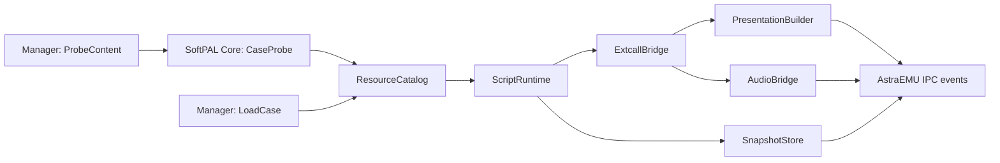

# SoftPAL Runtime Core Design

SoftPAL core 是 AstraEMU 的 family core，不是 Astra Runtime 的 creator-facing 模型。它的职责是模拟旧 SoftPAL 状态机，并把结果翻译成 AstraEMU IPC contract。

## Core modules

| module | 职责 |
| --- | --- |
| `CaseProbe` | 检查 game root、NLS、PAC、核心 DAT、script header、hash 和缺失项 |
| `ResourceCatalog` | 复现 ResourceManager 查找顺序，提供只读 asset reference |
| `ScriptImage` | 解析 `Sv20`、`POINT.DAT`、opcode metadata |
| `ScriptRuntime` | VM PC、stack、memory、wait、thread、save deterministic state |
| `ExtcallBridge` | 按 category/index 分派 text/sprite/audio/save/file/profile 等 handler |
| `PresentationBuilder` | 把 SoftPAL sprite/text state 转成 `PresentationCommand` |
| `AudioBridge` | 把 BGM/SE/voice/BGV 转成 `AudioCommand` |
| `SnapshotStore` | 保存和恢复 VM state，不保存 platform handle |
| `Diagnostics` | 输出 PC、opcode、extcall、resource、status、hash 和 concern |

保持这些模块足够直接。除非两个 family 真的共享同一行为，不新增跨 family 抽象。

## IPC flow



Manager 不解析 `SCRIPT.SRC`、不读 `Mem.dat`、不持有旧 VM 内存。Core 不创建 Editor UI，也不把 renderer/audio native handle 写进 snapshot。

## Determinism

Core state 只受这些输入影响：

- loaded case metadata 和 resource bytes hash；
- fixed tick index 和 `pal_time_ms`；
- ordered input edge list；
- deterministic provider result，例如 media load success/failure code；
- previously restored snapshot。

任何可能挂起的动作都要变成 serializable wait token：

```text
SoftPalAwaitToken {
  kind: "click_or_time",
  pc: 0x00012340,
  started_tick: 431,
  deadline_ms: 1200
}
```

token completion 在下一 fixed tick 进入 ordered event queue。

## Resource safety

Core 以 read-only mount 读取本地 game root。默认权限：

| capability | default |
| --- | --- |
| read game resource | allow |
| write save directory | allow, scoped |
| read arbitrary filesystem path | deny |
| network | deny |
| launch external process | deny |
| load legacy DLL | deny |

category 18 的 file/profile/app helper 要走 capability check。`app_exec`、disc check、external update access 这类旧行为默认只能返回安全诊断或 no-op，除非手动启用受限 provider。

## Data contracts

SoftPAL core 需要输出 machine-readable report：

```json
{
  "family": "softpal",
  "nls": "sjis",
  "script": { "magic": "Sv20", "check": "0x64CB7790", "entry": "0x00000290" },
  "resources": { "archives": 20, "coreAssets": 7 },
  "coverage": { "extcallsKnown": 0, "extcallsConcern": 0 },
  "concerns": []
}
```

`extcallsKnown` 的实际值由实现后的 scanner 填充；文档不提前写成已达成。

## Minimal vertical slice

第一条可验收 route：

1. Probe 本地样本，识别 SoftPAL 和核心资源。
2. Load `SCRIPT.SRC`、`POINT.DAT`、`FILE.DAT`、`TEXT.DAT`、`MEM.DAT`。
3. 执行到 title/menu 首个稳定 wait。
4. 输出 scene hash、sprite count、text state、BGM state、VM PC。
5. Save snapshot，reload 后 PC/memory/text/history 一致。

旧 VN 兼容不能成为 NativeVN、Editor 或 EngineCore 达标前置条件。SoftPAL route 自己通过 family release gate 即可。
