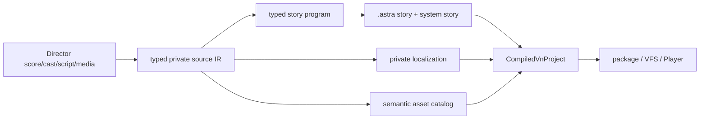

# Director 7 到 AstraVN 的生产迁移方法

## 1. 目标与证据边界

本文总结《终之空》1999 原版迁移中已经验证的 Director 7 读取方法，供合法持有源数据的 VN 迁移项目复用。它描述资源身份、控制流和演出语义怎样进入 AstraVN，不保存商业正文、脚本 body、素材 payload 或本机路径。

迁移器是离线工具，不是 Player 的兼容层。Cook 后的项目只依赖 `.astra`、localization、asset catalog/VFS 和 AstraVN Runtime；Director VM、ProjectorRays 与原安装目录都不能进入 shipping 闭包。

## 2. 容器与资源证据链

读取顺序固定如下：

```text
projector / movie
  -> strict RIFX reader
  -> imap -> mmap
  -> KEY* / CAS* cast binding
  -> Lctx / Lnam / Lscr script identity
  -> VWSC / VWLB score and label identity
  -> STXT / BITD / snd media identity
  -> typed private conversion IR
```

ProjectorRays JSON 只接受已经证明的 `\\v` 与 `\\xHH` 扩展转义。`\\xHH` 先恢复为 bytes；只有 cast/STXT 中已证明采用 CP932 的字段才执行严格 CP932 decode。非法 byte sequence、未终止字符串或字段边界不明时阻断，不能全局“修复乱码”。

Director container reader 必须同时证明：

- RIFX declared size 与文件长度精确一致；
- `imap` 指向的 `mmap` 完整、entry 对齐且资源范围不重叠；
- free `mmap` entry 不计作 payload evidence；
- `KEY*`、`CAS*` 与 child resource 的 id/hash 闭合；
- 同一 `CASt` 不能绑定多个 library/slot；
- `Lctx` 按 32-bit entry 对齐，`Lnam` 是有界且以 NUL 终止的 name table；
- 每个 `Lscr` 的 resource id、container entry id、payload hash 与 reader source-map 一致；
- `STXT`、`BITD`、`snd` 只按各自已验证的 header/codec 读取。

任一环节断裂时，后续 route、cast、script 或 media coverage 都不得从文件名、顺序或相似 hash 猜测。

## 3. Score、cast 与脚本绑定

`VWSC` 使用 Director 7 delta score。reader 从完整 channel buffer 开始，逐 frame 应用 `(offset,size,bytes)` delta，再读取 main channel 与 sprite channel。当前已验证布局为 frames version 13、48-byte sprite record；不符合该布局时阻断。

每个可执行 frame 的身份由 movie id、frame number、label identity、main action cast reference、sprite channel cast reference 与 resource payload hash 共同决定。`VWLB` label、Score action、`Lscr` source 和 handler 必须一一闭合。label 只有在 frame 位于 score 范围且 action resource 可解析时才能成为控制流入口；原作确有但未被引用的悬空 label，可以作为原始缺陷记录，却不能虚构 frame。

cast member 的几何来自 Score channel 状态和经过验证的 cast metadata：channel、x/y、width/height、ink、blend、anchor、crop 与 layer 都必须进入 typed IR。角色 atlas 的 part、pose、expression、mouth/eye compatibility 不能被压平成一张静态图片。

旧 Director bitmap 的“白底”不一定是可见背景。只有已证明的 802×602 人物 matte 才能按边缘连通白区派生为 800×600 alpha；754×82 对话框也必须根据已验证的 matte 比例恢复透明度。派生器要记录 source/converted hash、尺寸、边缘判定、visible bbox 和绑定 command，边界颜色或尺寸不符时阻断。Renderer 继续使用 premultiplied-alpha 约定，eye/background/character/dialogue 的 z-order 按 Score channel 执行，不能在 shader 或 UI theme 中补偿错误资源。

## 4. 私有 IR 与 AstraVN lowering

Director movie 和 handler 先变成 typed private IR，再生成普通 AstraVN 项目：



lowering 规则如下：

- `if/else`、`case` 变成 typed branch，变量缺失时阻断；
- global/day flag、selector enabled state 变成序列化 mutation；
- `go`/label、movie dispatch 变成可验证 jump；
- handler call/return 变成显式 call frame；
- `talk`、`mono`、`monoreturn` 选择 typed reading surface；
- choice 保留原 option identity、enabled 条件和选择后的 mutation；
- BGM/SE/voice/movie 形成 typed media command；fade、stop、loop 与 fence 保持原顺序；
- `wait`、input wait、media fence 都分配可序列化 occurrence identity；
- background、character、event、shade、dialogue frame 形成 Stage command；
- 无出边 state 只有执行完自身命令后才能成为 terminal。

系统页需要保存可重建的底层画面语义，而不是保存 Host texture。AstraVN 的 system frame 保留最初 `return_cursor`、`return_wait` 和 `return_choice`；UI model 据此解析 Title system story 或当前 dialogue/choice underlay。`SwitchSystemPage` 只替换顶部页面，不增加 stack depth，也不丢失这组 return identity。解析不唯一、backlog entry 缺失或 page/action/slot 未在 profile v2 声明时必须阻断。

Director 的公共布局需求进入通用 UI contract：绝对定位节点可声明 bounded max extent，容器可显式 clip children，文本可声明 padding/alignment。它们不携带 TsuiNoSora resource id；Classic 只是在项目 blueprint 中使用这些能力表达 800×600 score 几何。

转换过程中不允许 unknown/no-op/synthetic fallback。旧 VM 的纯 frame polling 只有在 AstraVN 已有等价 deterministic wait/presentation contract，并在 coverage report 中明确分类时，才可由公共能力取代。

## 5. 失败策略与可观测性

unknown handler/command、不可证明的条件、resource/hash 断裂、重复 cast binding/route/choice、selector 项数不一致、不可达 jump/call/terminal、运行闭包混入 dump/Lingo/空音频标记，以及 report 出现正文、payload-like 字段或本地路径，全部必须在写出 `.astra` 前阻断。

公开 report 只记录 schema、stable id、resource id、frame/channel、hash、计数、coverage 和 diagnostic。详细 IR、正文、截图、diff 和生成项目只保存在 ignored 私有工作区。

## 6. 验收层级

结构覆盖不是产品通过。完成迁移至少需要 resource/handler/command/route/terminal/choice/media/wait 全覆盖、Cook/package/VFS identity 闭合、物理输入 Headless E2、GPU 视觉比较、Windows Player E3，以及独立 formal human signoff。旧 package route report、静态截图或 Headless E2 都不能替代真实平台证据。
