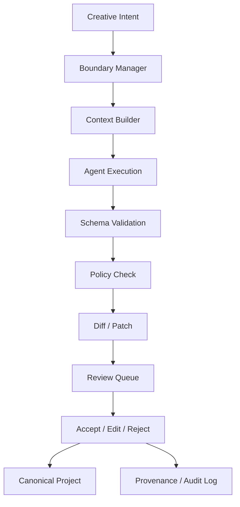

# AI 协作系统设计

## 1. 设计目标

AI Agent 是创作协作层，不是作品接管者。系统目标是在不牺牲创作者控制权、可发布性和可审计性的前提下，把 AI 融入 VN 制作流程。

核心要求：

- AI 输出默认进入建议层。
- 正式内容必须由人类接受或编辑后进入 Canonical Project。
- AI 操作必须经过 Boundary Manager。
- 所有 AI 参与内容必须记录来源和审计信息。
- 发布包必须能明确声明是否包含运行时动态 AI。
- 文本源数据必须对 AI 和 MCP 友好，支持稳定 ID、YAML diff、schema 校验和审计。

### 1.1 AI 三类职责

统一重构后，AstraEngine 将 AI 职责明确分为三类：

- 资产生成：人物立绘、背景、语音、标签和资产草稿生成。
- Agent 协作：开发阶段覆盖企划、设定、剧本、资产、本地化、测试、构建和发布的项目级协作。
- 运行时受控内容生成：在 Runtime MCP Host、Boundary Manager 和 Save/Replay/Fallback 约束下生成闲聊、反应、旁白变体或受限分支内容。

这三类职责共享统一的 MCP / Agent 协议层，但不共享同一权限语义：

- 开发阶段协作走 `Editor MCP Host`。
- 运行时受控生成走 `Runtime MCP Host`。
- 真正的模型调用由独立 Provider 模块负责。
- 工具副作用与生成来源由独立 Agent Audit 模块负责。

## 2. AI 参与等级

```text
Level 0: AI Off
完全关闭 AI，只作为传统 VN 引擎使用。

Level 1: AI Advisor
AI 只提供建议，不生成正式内容。

Level 2: AI Assistant
AI 可以生成候选内容，但必须人工确认。

Level 3: AI Co-Writer
AI 可以批量生成内容，但全部进入 Review Queue。

Level 4: Runtime Constrained AI
AI 可以在运行时生成受约束内容，但不得破坏主线、设定和存档一致性。

Level 5: Experimental AI Director
实验模式，允许更高自由度，仅适合研究或测试。
```

默认项目策略应为 Level 0 或 Level 2，避免新项目在未配置审核策略前误用 AI。

## 3. 内容来源模型

正式内容需要记录来源：

```cpp
enum class ContentOrigin {
    HumanAuthored,
    AISuggested,
    AIGeneratedHumanApproved,
    AIGeneratedHumanEdited,
    ExternalReferenced,
};
```

建议所有可发布内容都带以下元数据：

```json
{
  "content_id": "line_02341",
  "origin": "AIGeneratedHumanEdited",
  "created_by": "dialogue_polisher",
  "approved_by": "author",
  "source_patch_id": "patch_20260526_0001",
  "audit_event_id": "audit_20260526_0001"
}
```

## 4. Boundary Manager

所有 AI 行为都必须经过 Boundary Manager。它负责把项目策略、阶段策略、内容权限和发布要求合并为一次具体操作的许可结果。

```text
Boundary Manager
├── Project AI Policy
├── Stage AI Policy
├── Content Permission
├── Review Requirement
├── Canon Lock
├── Runtime MCP Permission
└── Audit Rule
```

示例配置：

```json
{
  "project_ai_policy": {
    "default_mode": "assistant",
    "allow_runtime_generation": false,
    "require_human_approval": true,
    "allow_ai_modify_canon": false,
    "allow_ai_create_new_lore": "suggest_only",
    "allow_ai_generate_assets": true,
    "allow_ai_generate_voice": "preview_only"
  }
}
```

许可结果建议：

```json
{
  "allowed": true,
  "requires_review": true,
  "allowed_targets": ["Scripts", "LoreDrafts"],
  "blocked_targets": ["CanonLore"],
  "reason": "AI may suggest new lore, but Canon Lore is locked."
}
```

## 5. Canon Lock

正式设定可以被锁定，AI 可以引用但不能修改。

```json
{
  "lore_id": "memory_fragment_rule",
  "content": "记忆碎片不能被主动读取，只会在强烈情绪接触时触发。",
  "locked": true,
  "ai_can_modify": false,
  "ai_can_reference": true
}
```

Canon Lock 规则：

- AI 可以读取 `ai_can_reference = true` 的设定作为上下文。
- AI 不得生成直接修改 locked lore 的 patch。
- AI 可以生成“变更建议”，但目标应进入 Lore Draft 或 Review Queue。
- 接受 Canon 修改需要显式人类操作和审计记录。

## 6. Agent 工作流



## 7. Context Builder

Context Builder 负责为 Agent 构建最小必要上下文，避免把整个项目直接塞给模型。

输入：

- 当前任务。
- 目标文件或 Story Node。
- 相关角色卡。
- 相关 Canon Lore。
- 剧情前后文。
- 风格指南。
- AI Policy。

输出：

```json
{
  "task": "polish_dialogue",
  "target": "Scripts/chapter_01.vn:line_120",
  "context_hash": "abc123",
  "included_lore": ["memory_fragment_rule"],
  "included_characters": ["alice"],
  "constraints": ["no_new_lore", "keep_melancholic_tone"],
  "redactions": ["private_notes"]
}
```

Context Builder 原则：

- 最小必要上下文。
- Canon 与 Draft 分层。
- 敏感内容可脱敏。
- 上下文可哈希、可复现。
- Runtime MCP / Generation 使用的上下文必须可随存档保存或回放。
- Context Builder 优先读取 YAML 源数据、asset sidecar、生成的只读索引和稳定 ID。

## 8. Review Queue

AI 输出默认进入审核队列。

```text
AI Output
  -> Schema Validation
  -> Policy Check
  -> Diff / Patch
  -> Review Queue
  -> Author Accept / Edit / Reject
  -> Canonical Project
```

Review Queue 内容包括：

- Dialogue Suggestions。
- Story Changes。
- Lore Changes。
- Character Changes。
- Scene Direction Suggestions。
- Asset Drafts。
- Translation Drafts。
- QA Fix Suggestions。

审核动作：

- Accept：按 patch 应用到 Canonical Project。
- Edit：人类修改 patch 后应用。
- Reject：拒绝并保留审计记录。
- Defer：延后处理。
- Split：把一个大 patch 拆成多个小 patch。

## 9. Diff / Patch 合约

AI 不直接替换文件，而是输出 patch。

```json
{
  "patch_type": "script_dialogue_replace",
  "target": "chapter_01.vn:line_120",
  "before": "你来了。",
  "after": "我还以为你不会来了。",
  "reason": "增强角色的失落感，与上一段等待场景呼应。"
}
```

编辑器显示为：

```diff
- alice "你来了。"
+ alice "我还以为你不会来了。"
```

Patch 要求：

- 包含明确目标。
- 包含变更前后。
- 包含生成理由。
- 包含来源 Agent 和模型信息。
- 可校验目标是否仍匹配，避免 stale patch 覆盖用户后续修改。
- 大规模生成必须拆分为可单独审核的小 patch。

Patch 目标应优先定位到文本源数据：

- `.astra` 脚本。
- `.asset.yaml` sidecar。
- `.character.yaml`。
- `.lore.yaml`。
- `.story.yaml`。
- `.loc.yaml`。
- `.review.yaml`。

## 10. Provenance / Audit Log

所有 AI 操作都记录来源。统一 MCP 化后，这部分记录由独立的 `Agent Audit` 模块承接，但仍分为两类事件：

- `Operation Log`：记录 tool side effect，例如 Editor MCP trusted direct write、runtime-safe tool 调用和验证/构建动作。
- `Generation Audit Log`：记录 prompt/context/output hash、provider、fallback、作者动作或玩家会话信息。

```json
{
  "event": "ai_suggestion_created",
  "agent": "dialogue_polisher",
  "model": "local-llm-v1",
  "target": "chapter_02.vn",
  "context_hash": "abc123",
  "output_hash": "def456",
  "author_action": "edited_then_accepted",
  "final_content_id": "line_02341"
}
```

审计日志要求：

- 追加写入，不直接修改历史事件。
- 可按内容、Agent、模型、作者动作查询。
- 可生成发布前 AI 使用报告。
- 不应保存明文 API Key。
- 对外发布报告可去除敏感 prompt，但保留统计和模型类别。
- Operation Log 与 Generation Audit Log 可以分别存储，但必须由统一 Agent Audit 模块生成和查询。

发布前 AI 使用审计报告：

```text
AI Content Audit
- AI 辅助剧本行数
- AI 生成后人工确认的内容
- 未审核 AI 内容数量
- AI 生成资源数量
- 使用的模型/工具
- 是否包含运行时动态 AI
- 是否允许离线运行
```

## 11. AI 融入制作全流程

### 11.1 Planning Desk

- 题材建议。
- 受众分析。
- 世界观草案。
- 制作规模评估。
- 风险分析。

### 11.2 Lore Studio

- 世界观补全。
- 设定矛盾检查。
- 时间线生成。
- 术语表生成。
- Canon Lock 检查。

### 11.3 Character Studio

- 角色卡生成。
- 口癖建议。
- 人物弧光分析。
- OOC 检测。
- 对话风格模拟。

### 11.4 Story Studio

- 大纲展开。
- 分支建议。
- 台词润色。
- 伏笔检查。
- 节奏分析。
- 结局路线规划。

### 11.5 Scene Studio

- 表情推荐。
- 立绘站位推荐。
- BGM 推荐。
- 转场建议。
- 分镜建议。

### 11.6 Asset Studio

- 资产需求列表。
- 资源命名规范。
- 标签生成。
- 缺口分析。
- AI 资源草稿。
- 人物立绘/背景/语音等资产生成。

### 11.7 Audio / Voice Lab

- TTS 预览。
- 语音缓存。
- 情绪标注。
- 语音时长估算。
- 字幕同步。

### 11.8 Localization Studio

- 翻译草稿。
- 术语一致性检查。
- 角色口吻保持。
- UI 文本溢出检查。

### 11.9 QA / Eval Lab

- 自动游玩。
- 分支覆盖率。
- 剧情矛盾检查。
- OOC 检查。
- 死分支检测。
- 文本溢出检测。

## 12. 运行时 MCP 与受控生成

运行时受控内容生成是可选扩展，不是默认核心。统一 MCP 化后，运行时侧由三块独立模块协作：

- `Runtime MCP Host`：统一运行时 resources、tools、prompts、session 和权限边界。
- `Runtime Generation Orchestrator`：负责 Context Builder、Boundary Manager、fallback、回放、把结果转成 RuntimeCommand。
- `Provider Modules`：负责调用本地或远程模型，不直接决定项目权限。

### 12.1 模式

```text
Mode A: No Runtime Generation
所有内容固定，适合传统商业 VN。

Mode B: Flavor Generation
只生成闲聊、旁白变体、环境描述，不影响主线。

Mode C: Reactive Generation
根据玩家选择生成角色反应，但不改变 Story Graph。

Mode D: Branch Generation
允许 Runtime Generation Orchestrator 在受约束 Story Graph 内生成或选择分支。

Mode E: Experimental AI Director
实验性 AI 导演模式。
```

### 12.2 限制

Runtime MCP session / 运行时 Agent 不能：

- 修改 Canon Lore。
- 永久改变主线结构。
- 生成不存在的资产路径。
- 绕过分级策略。
- 绕过存档系统。
- 产生不可回放内容。
- 获得 `project_write` 或 Editor trusted direct write 权限。

运行时生成内容必须：

- 保存快照。
- 保存 prompt hash。
- 保存 output hash。
- 可回放。
- 可禁用。
- 可 fallback。
- 可由 Agent Audit 模块追踪到 provider、session、tool 调用和最终 RuntimeCommand。

## 13. Provider 模块

Provider 必须作为独立动态模块实现，不与 MCP host 或 Runtime Generation Orchestrator 混在同一模块中。核心接口只描述能力和请求，不绑定具体云服务。

```cpp
class IAIProvider {
public:
    virtual ~IAIProvider() = default;

    virtual AIProviderInfo info() const = 0;
    virtual Expected<AIResponse, AIError> complete(const AIRequest& request) = 0;
    virtual Expected<StreamHandle, AIError> streamComplete(const AIRequest& request) = 0;
};
```

Provider 需要声明：

- 是否联网。
- 是否可离线。
- 支持文本、图像、音频或多模态。
- 是否允许运行时使用。
- 是否保存外部服务日志。
- 是否支持确定性参数。
- 是否具备 `runtime.packaged` 资格。

推荐 Provider 模块族：

- 文本 LLM Provider。
- 图像生成 Provider。
- TTS Provider。
- 本地模型 Provider。

## 14. 统一 MCP / Agent 能力层与 AI 的关系

MCP 不是 AI Provider。统一重构后，MCP 是 AstraEngine 的 Agent 能力协议层，负责定义 resources、tools、prompts、sessions 和权限边界。它有两个 host：

- `Editor MCP Host`：外部 Agent 调用项目上下文、验证/构建工具和 trusted direct write。
- `Runtime MCP Host`：运行时受控生成调用 runtime-safe resources/tools/prompts。

默认 AI 工作流：

```text
AI Output
  -> Schema Validation
  -> Policy Check
  -> Diff / Patch
  -> Review Queue
  -> Author Accept / Edit / Reject
```

Editor MCP trusted direct write 工作流：

```text
Trusted MCP Tool Call
  -> Workspace Boundary Check
  -> Text Source Write
  -> Agent Audit / Operation Log
  -> Optional Validation / Release Gate
```

Runtime MCP / Generation 工作流：

```text
Runtime MCP Session
  -> Context Builder
  -> Boundary Manager
  -> Runtime-safe Resource / Tool Calls
  -> Provider Module
  -> RuntimeCommand
  -> Save / Replay / Fallback
  -> Agent Audit / Generation Log
```

规则：

- 普通 AI 输出默认进入 Review Queue。
- Editor MCP trusted session 可以直接写入 workspace/project 内文本源文件。
- Editor MCP 直接写入不强制进入 Review Queue。
- Runtime MCP Host 不允许 project source direct write。
- MCP mutating tools 必须记录 Operation Log。
- 运行时生成必须记录 Generation Audit Log。
- 如果 MCP 写入或运行时输出被标记为 AI-generated 或 AI-edited，应同时进入 Generation Audit。
- MCP 不暴露明文 API key、未授权外部路径、ECS/EnTT 内部状态。

## 15. Text-First AI 约束

AI 可编辑的项目源数据应采用 YAML + JSON Schema。

AI 友好规则：

- 所有文本源对象必须有稳定 ID。
- 长文本字段使用 YAML block scalar。
- 列表项使用稳定 ID，避免靠数组位置表达语义。
- 字段应区分 AI-editable、tool-generated、read-only。
- 二进制资源语义写入 `.asset.yaml` sidecar。
- Cooked、DerivedDataCache、package manifest 不作为 AI 编辑源。

## 16. 安全与隐私

最低要求：

- API Key 不写入项目文件。
- Prompt 中的私密备注可脱敏。
- 外部服务调用需在项目配置中显式启用。
- Runtime Build 默认不包含网络 AI Provider。
- 审计日志不保存不可公开的密钥或账号信息。
- 插件权限应在编辑器中可见。
- Editor MCP trusted direct write 不允许访问明文密钥或未授权外部路径。
- Runtime MCP Host 不允许获取 project_write、Editor UI 对象或未经授权的宿主文件系统能力。
