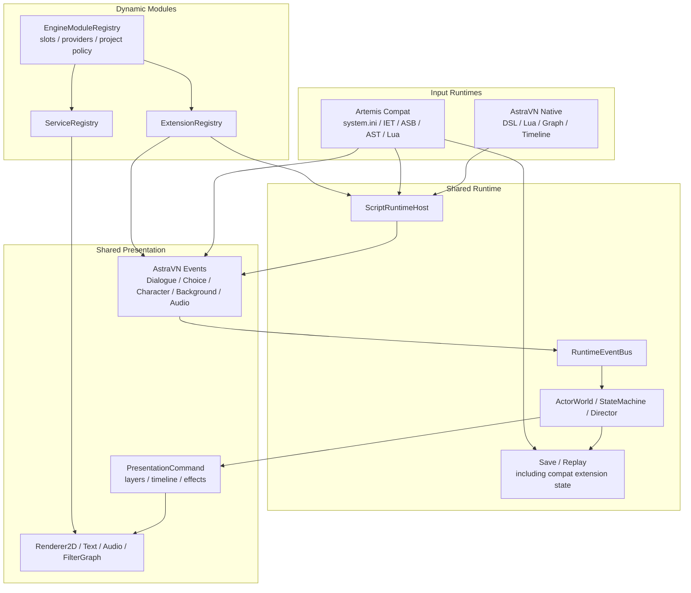

# 总体架构设计

## 1. 项目定位

AstraEngine 是高度可定制化、模块化的 2D 引擎。它以视觉小说和互动叙事为第一落地场景，但 Core 面向更广的 2D 叙事、演出和轻量玩法：

- 传统视觉小说、ADV、互动小说。
- 动态漫画、动态绘本、点击解谜、养成、轻 RPG、回合制和卡牌。
- AI 协作式创作与运行时受控内容生成。
- 旧 VN 引擎模拟器、兼容运行与现代化表现。

非目标：

- 不以复杂 3D 动作、FPS、高实时网络竞技或大型开放世界为主目标。
- 不引入完整 UE `UObject`、UHT、GC 或跨 ABI C++ Actor 继承体系。
- 不让 AI、Live2D、Lua 或旧 VM 污染 Core。

### 2D UE-class Runtime Parity

本文档中的 “UE-class runtime” 指 **工程完备度对标**，不是功能版图照搬。
AstraEngine 的目标是在 2D / VN-first 范围内达到类似 UE 去掉 Editor 后的运行时成熟度：

- Runtime 可独立于 Editor 完成 cook、package、launch、save、replay、debug、profile 和 release validation。
- Core、Runtime、Asset、Media、Script 和 AstraVN 具备稳定 public API、版本迁移、错误恢复、诊断观测和压力测试。
- 动态模块、资产管线、脚本运行时、media backend 和存档回放可以支持真实项目发布。
- Editor 是 authoring 和 debugger 工具，不是 runtime 发布前置条件。

这不要求 AstraEngine 实现复杂 3D renderer、物理、网络复制、大型开放世界 streaming
或 UE `UObject` / UHT / GC 等体系。

### Creator Experience Parity

“UE 级创作者友好度”指创作者能从模板开始，在同一工具链内完成项目、资产、脚本、
Graph、Timeline、调试、打包和发布，而不需要理解底层 runtime 细节：

- Project Wizard 和 Template Browser 可创建原生 AstraVN 项目、sample project 和插件项目。
- Content Browser 支持导入、生成、批量重命名、依赖查看、引用修复、迁移和 release validation。
- Inspector 使用 PropertySystem metadata 展示 Actor、Component、Asset、StateMachine、Script state。
- Script / Graph / Timeline / FilterGraph Editor 使用 canonical source，不维护独立预览模型。
- PIE、Runtime Debugger、Event Log、Save/Replay Inspector 和 Profiler 使用同一 Runtime public API。
- Cook / Package / Release Gate 可由 Editor、CLI 或 MCP 调用，诊断格式一致。
- AI Copilot 和 AI 内容生成必须进入 Review Queue 或 trusted session，不直接破坏正式源数据。

Creator-facing 状态流：

```text
Template -> Project -> Content -> Script/Graph/Timeline -> PIE -> Cook -> Package
Draft -> Review -> Accepted -> Canonical Source -> Cooked
Suggestion -> Patch Proposal -> Review -> Apply
Runtime Feedback -> AIIntent -> Validate -> Commit -> Save/Replay
```

### Customization Parity

“UE 级可定制度”指项目和插件能替换或扩展引擎能力，而不破坏 Core 边界：

- EngineModuleSlot：选择 Renderer2D、TextLayout、Audio、ScriptRuntime、PresentationLibrary 等 provider。
- Plugin：通过 C ABI 注册 service、extension、slot provider、MCP resource/tool/prompt。
- PropertySystem：为 Inspector、schema、AI review、MCP field editing 定义可编辑边界。
- Editor extension：通过 `IEditorPanelProvider`、命令、菜单、context action 和 asset editor 扩展工具界面。
- Asset pipeline extension：通过 `IAssetImporter`、`ICookProcessor`、package/read-only mount 扩展内容管线。
- AI/MCP extension：通过 `IAIProvider`、`IMcpToolProvider`、Agent Audit sink 扩展创作和运行时受控生成。

可替换能力必须声明 capability、permission、packaged eligibility 和 release gate policy。
任何扩展都不能跨 ABI 传递 C++ ownership、Actor 指针、native renderer/audio handle 或 Editor widget。

### Public Contracts

Creator-facing schema 必须先于 UI 实现稳定下来，Editor、CLI、MCP 和 Release Gate 共享同一套 schema：

- Project template descriptor：模板 ID、目标 runtime、默认 provider、示例内容、初始化步骤、验收命令。
- Asset import preset：source 类型、输出 asset 类型、sidecar 默认值、cook preset、license/review policy。
- Editor layout preset：panel id、dock area、visibility、command bindings、project/user override 规则。
- Component inspector metadata：display name、category、order、visibility condition、read/write/review flags。
- Graph/timeline source schema：node/track/event/schema version、source map、debug symbol、hot reload policy。
- AI draft sidecar：provider、prompt/context/output hash、provenance、review state、license、canonical import target。
- Review queue item：operation kind、diff/artifact refs、diagnostics、approver、apply/reject/rollback command。
- Plugin wizard template：descriptor skeleton、capability/permission template、sample test、manual stub、release checklist。

Customization contracts 必须通过模块和 provider 注册，而不是硬编码到 Editor：

```text
IEditorPanelProvider
IAssetImporter
ICookProcessor
IScriptRuntimeProvider
IPresentationLibraryProvider
IRenderer2DProvider
ITextLayoutProvider
IAudioProvider
IMcpToolProvider
IAIProvider
```

每个 contract 都必须定义 descriptor、required services、permission、diagnostics、sample plugin、
release gate rule 和 packaged eligibility。Editor 可以提供可视化配置，但 Runtime 只消费通过
Release Gate 验证过的 policy 和 package manifest。

### Dependency Matrix

```text
Core        -> none
Platform    -> Core
Module      -> Core, Platform
Property    -> Core
Asset       -> Core, Platform, Property
Scene       -> Core, Property
Runtime     -> Core, Scene, Property
Media       -> Core, Platform, Asset, Runtime
Script      -> Core, Runtime, Asset
AstraVN     -> Core, Runtime, Scene, Script, Media, Asset
AI          -> Core, Runtime, Asset, Module
MCP         -> Core, Module, AI, Editor/Runtime host boundary
Editor      -> Runtime, Scene, Asset, Media, Script, AstraVN, AI, MCP
Compat      -> Runtime, Asset, Media, Script (expansion only)
```

禁止依赖：

- Core 不依赖 Platform、Runtime、VN、AI、MCP、Editor、Compat、SDL、Lua、renderer、audio。
- Runtime 不依赖 Editor UI、Editor widget、MCP server implementation 或 AI provider implementation。
- Media public API 不暴露 SDL/GPU/audio native handle。
- Editor 不拥有 runtime state；只能通过 public inspector/debugger API 观察和命令 runtime。
- Compat 不得作为 native runtime parity 的前置依赖。

实现规格入口：

- `foundation-core-platform-property.md`：Core 类型、diagnostics、config、serialization、Platform、PropertySystem。
- `runtime-core.md`：RuntimeWorld、tick、event、scheduler、state machine、save/replay。
- `asset-pipeline.md`：AssetId、VFS、Importer、Cooker、DDC、package manifest、asset release gate。
- `media-runtime.md`：Renderer2D、TextLayout、Audio、Timeline、FilterGraph。
- `script-and-presentation.md`：ScriptRuntimeHost、Native DSL、Lua、Graph/Timeline、PresentationCommand、AstraVN。
- `tools-release-observability.md`：CLI、Release Gate、trace、profiling、crash report、CI matrix。

## 2. 顶层分层

```text
AstraEngine
├─ Core
│  ├─ Foundation
│  ├─ ModuleManager
│  ├─ ServiceRegistry
│  ├─ PropertySystem
│  └─ Serialization
├─ Platform
│  ├─ Window / Input / FileSystem
│  ├─ Thread / Timer
│  └─ DynamicLibrary
├─ Asset
│  ├─ AssetId / ResourceHandle
│  ├─ VFS / PackageReader
│  ├─ AssetRegistry
│  ├─ Importer / Cooker
│  └─ HotReload
├─ Media
│  ├─ RHI / Renderer2D
│  ├─ RenderGraph / FilterGraph
│  ├─ Text / Font
│  ├─ Audio / Video
│  └─ Animation
├─ Scene
│  ├─ World / Scene
│  ├─ Actor / Component
│  ├─ Prefab / Defaults
│  └─ Local ECS / Data-Oriented Packs
├─ Runtime
│  ├─ EventBus
│  ├─ StateMachineRuntime
│  ├─ Task / Coroutine Scheduler
│  ├─ Blackboard
│  ├─ ControlPolicy / Director
│  └─ Save / Load / Replay
├─ Script
│  ├─ ScriptRuntimeHost
│  ├─ Native Script Runtime
│  ├─ Lua Runtime
│  ├─ Legacy VM Runtime
│  └─ Debug / Event Bridge
├─ Presentation
│  ├─ Timeline
│  ├─ UI / Camera / Effects
│  ├─ Presentation Command
│  └─ Presentation Libraries
├─ AstraVN
│  ├─ VN DSL / Graph
│  ├─ Dialogue / Choice
│  ├─ Character / Background / Audio Cue
│  └─ VN State Machines
├─ AI
│  ├─ Editor Collaboration
│  ├─ Runtime Intent
│  ├─ Provider Modules
│  └─ Agent Audit
├─ Compat
│  ├─ Legacy Package Readers
│  ├─ Legacy VM / Script Runtime
│  ├─ API Mapper
│  ├─ Modernization Profile
│  └─ Compatibility Inspector
└─ Editor
   ├─ Script / Graph / Timeline Editors
   ├─ Scene / Asset / Inspector
   ├─ Editor Copilot MCP / Content Generation MCP / Review Queue
   └─ Runtime Debugger
```

`Compat` 是后期扩展轨。它依赖稳定的 Runtime、Asset、Media 和 Script API，
但不是 native runtime 达到 production parity 的前置条件，也不能反向污染 Core。

## 3. 核心运行链路

创作与运行的主要链路分三层：

```text
Creator DSL / Graph / Legacy VM / AI Intent
  -> Runtime Event
  -> Actor-bound StateMachine
  -> Presentation Command
  -> Scene / Media / Asset / Audio / FilterGraph
```

示例：

```text
say alice "早上好。"
  -> VN.SayRequested
  -> DialogueSystemActor.DialogueBoxSM
  -> Alice.DialogueSM + Alice.AnimationSM
  -> CreateTextBox / StartTypewriter / PlayVoice
```

`RuntimeCommand` 可作为日志、回放和兼容适配的记录格式存在，但不是唯一运行时中心。核心中心是 Actor、EventBus、StateMachineRuntime 和 Presentation Command。

## 4. Core 与 VN 边界

Core 负责：

- 基础类型、日志、错误、配置、时间、路径。
- ModuleManager、ServiceRegistry、ExtensionRegistry。
- PropertySystem、TypeId、PropertyId、schema generation。
- 序列化、版本迁移和 diagnostics。

Runtime/Scene 负责：

- Actor、Component、World、Scene、StateMachineRuntime、EventBus。
- ControlPolicy、Blackboard、Task/Coroutine、Save/Replay。

AstraVN 负责：

- VN DSL、VN Event、VN Graph。
- Dialogue、Choice、Character、Background、Audio cue。
- 预定义 VN 状态机和 VN Presentation Library。

Core 不负责：

- VN 剧情语义、Live2D、AI 生成、旧 VN opcode、具体模型 Provider、编辑器 UI。

## 5. Actor、状态机与 Director

Actor 是公开运行时对象模型。每个 Actor 可挂载普通 Component 和 StateMachineComponent。

```text
CharacterActor Alice
├─ TransformComponent
├─ BlackboardComponent
├─ ControlPolicyComponent
├─ CharacterPresentationSM
├─ EmotionSM
├─ DialogueSM
├─ AnimationSM
└─ AIBehaviorSM
```

多状态机协作通过以下机制完成：

- `EventBus`：分发 RuntimeEvent、VNEvent、PresentationEvent。
- `Blackboard`：共享角色、场景或系统上下文。
- `ControlPolicy`：判断控制权、优先级、打断、排队或拒绝。
- `Director`：负责全局叙事仲裁、Timeline lock 和剧情阶段约束。

## 6. Script Runtime

`ScriptRuntimeHost` 管理多个同级脚本运行时：

```text
ScriptRuntimeHost
├─ AstraNativeRuntime
├─ LuaRuntime
├─ BGIRuntime
├─ KirikiriRuntime
└─ CustomRuntime
```

脚本运行时只能通过 Script API、RuntimeEvent 和 Presentation API 影响世界。旧 VM 不需要反编译为 Astra DSL；它可以保存自己的 VM 状态并通过 API Mapper 输出事件。

## 7. Media 与 FilterGraph

`Media` 提供 2D 表现基础。FilterGraph 是统一后处理和现代化管线：

```text
Layer Render
  -> Per-Layer FilterGraph
  -> Composite
  -> Native UI / Text
  -> Final Screen FilterGraph
  -> Present
```

旧游戏现代化必须尽量 layer-aware：背景、角色、UI、文本、最终画面分别处理。文本优先重新排版，不做截图式超分。

## 8. 插件与模块

项目级扩展默认使用动态模块。模块通过 C ABI 进入，使用 ServiceRegistry 和 ExtensionRegistry 注册能力：

- Actor type、Component descriptor、StateMachine type。
- Script runtime、Script API provider。
- Filter、Renderer pass、Asset importer、Cook processor。
- AI Provider、Runtime Intent validator、Agent audit sink。
- Legacy package reader、VM runtime、API mapper、modernization profile。
- Editor panel、MCP resource/tool/prompt。

跨 ABI 不传递 STL ownership、C++ Actor 指针、renderer/audio native handle 或 Editor widget。

### Engine Module Slot

ServiceRegistry 和 ExtensionRegistry 之上存在 Engine Module Slot 选择层，用于类似 UE 的深度定制。
模块可以注册 slot provider，项目通过 `engine_modules.selections` 显式选择最终实现。未选择时使用
slot 的默认 provider；不按 priority 或加载顺序隐式替换。



AstraVN 原生项目和 Artemis 兼容项目目标上共享 Runtime、Presentation、Media、Save 和
Inspector 能力；输入脚本语言、Artemis VM 控制流、`e:*` 宿主 API 和外部资产 resolver
保持在兼容模块内。Legacy compatibility 必须在稳定 native runtime 之上实现，不能作为
Core、Runtime、Asset 或 Media 的早期达标前置项。

Artemis compat 的真实案例、v1 路线和 `foreign-artemis:/` policy 在
`compatibility-layer.md` 中定义；AstraVN 与 compat runtime 的共享/不共享边界在
`script-and-presentation.md` 的 shared VN semantics 小节中定义。

## 9. 存档与回放

存档不能只保存 label 和变量。必须保存：

- World、Scene、Actor 和 Component 状态。
- 所有 StateMachine 当前状态和延迟事件。
- Blackboard、ControlPolicy lock、Director 状态。
- Script Runtime 状态。
- AI 已提交输出和 committed intent。
- FilterProfile、Timeline、资源覆盖、legacy VM extension state。
- 随机种子和 replay log。

AI 生成内容一旦提交，必须作为确定性数据写入存档，而不是每次重新生成。

## 10. MVP 顺序

1. Core + Platform + Module + Property。
2. Actor/Component + EventBus + StateMachineRuntime。
3. Asset + Media + FilterGraph。
4. ScriptRuntimeHost + Astra Native Script。
5. AstraVN 最小 Dialogue/Choice/Character/Background。
6. Runtime core production completion：deterministic tick、scheduler、save/replay、diagnostics。
7. Asset pipeline production completion：import、cook、package、release gate。
8. Media backend production completion：real renderer、text/font、audio、timeline、filter execution。
9. Creator Experience Rebuild：Project Wizard、Content Browser、Inspector、Graph/Timeline、PIE、Package。
10. Customization Framework Rebuild：Plugin Wizard、EngineModuleSlot、provider contracts、Editor panel、MCP tool。
11. Editor 基础和 Runtime Debugger。
12. AI MCP Rebuild：Runtime AI MCP、Editor Copilot MCP、Editor Content Generation MCP。
13. Production hardening 和 UE-class 2D runtime acceptance。
14. Expansion track：Legacy VN 模拟器和现代化插件。
