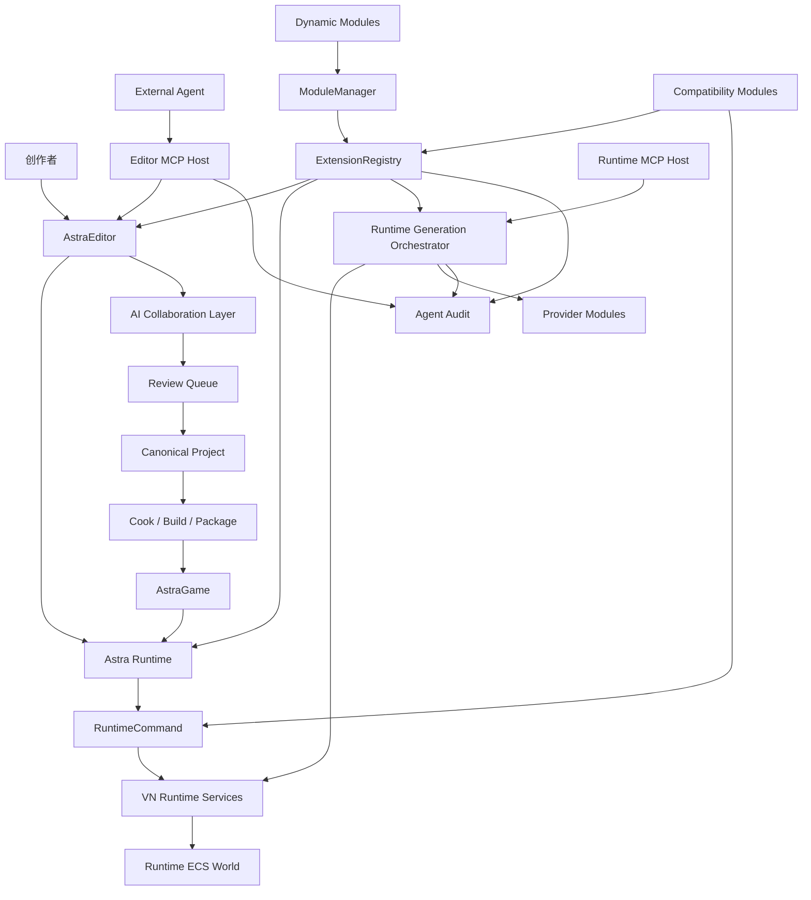

# 总体架构设计

## 1. 项目定位

AstraEngine 是基于 SDL3、现代 C++、vcpkg 和 CMake 的视觉小说专用、UE 风格可定制 AI 辅助引擎与开发套件。

它不是单纯 VN 播放器，也不是单纯 AI 写作工具，而是完整的创作、审查、运行、构建和发布系统：

- 支持传统确定性 VN 制作与商业发布。
- 支持 AI Agent 参与企划、设定、角色、剧本、场景、资产、本地化、测试和发布。
- 通过 Boundary Manager、Review Queue、Diff/Patch、Provenance/Audit Log 保证创作者拥有最终控制权。
- 采用 Editor/Game 分离、模块化、插件化、资产注册表、Cook/Package、Play-In-Editor 工作流。
- 使用现代 C++ 基础库与高级特性，避免重建一套与标准库重复的基础容器体系。
- 支持通过动态兼容模块只读挂载、解析和现代化不同 VN 引擎生成的项目和游戏包。
- 通过动态模块、扩展注册表和 VN Property System，在视觉小说领域提供接近 UE 的可定制化和扩展性。
- 不追求通用 3D 引擎、物理系统、通用 Actor/Gameplay 框架或完整 UObject 体系。

## 2. 系统上下文



核心思想是“Astra Runtime 是唯一运行时主线，动态模块通过扩展点增强它，而不是替代它”。

其他运行入口包括：

- Runtime MCP Host。
- Runtime Generation Orchestrator。
- Editor Preview。
- Headless Test。

下层服务包括：

- Stage。
- Dialogue。
- Choice。
- Audio。
- Asset。
- Input。
- Save。
- Localization。

Runtime Services 内部通过 Runtime ECS World 存储运行时状态并执行固定 schedule。ECS 是内部实现细节，不改变 RuntimeCommand 或服务 facade 的对外边界。

外部 Agent 通过 Editor MCP Host 访问 Editor/Developer 工具链。Editor MCP Host 读取 Text-First 源数据、调用验证和构建工具，并在 trusted session 中直接写入 workspace/project 内文本源文件。

Runtime MCP Host 只暴露 runtime-safe resources、tools 和 prompts；运行时受控内容生成由 Runtime Generation Orchestrator 驱动，再通过 RuntimeCommand 和 Runtime Services 落地。Provider Modules 负责模型调用，Agent Audit 模块负责记录工具副作用和生成来源。动态模块通过 ModuleManager 加载，通过 ExtensionRegistry 注册 RuntimeCommand source、Runtime Services 扩展、资产管线、Editor UI、MCP host/tool、Provider 和兼容模块能力。插件不直接访问 Runtime ECS、Renderer2D、AudioCore 或 Editor 内部对象。

## 3. 顶层目录建议

```text
AstraEngine
├── Engine
│   ├── Runtime
│   ├── Editor
│   ├── Developer
│   ├── Programs
│   └── Plugins
├── Projects
├── docs
│   └── design
├── CMakeLists.txt
└── vcpkg.json
```

建议将引擎代码与样例项目分离：

```text
Engine
├── Runtime
│   ├── Core
│   ├── ApplicationCore
│   ├── PlatformSDL3
│   ├── RHI
│   ├── Renderer2D
│   ├── AudioCore
│   ├── TextCore
│   ├── AssetCore
│   ├── AssetRegistry
│   ├── VFS
│   ├── PackageRuntime
│   ├── ModuleRuntime
│   ├── ExtensionRegistry
│   ├── MCPCore
│   ├── VNPropertySystem
│   ├── VNRuntimeServices
│   │   └── ECS
│   ├── AstraRuntime
│   ├── RuntimeMCPHost
│   ├── RuntimeGeneration
│   ├── AgentAudit
│   ├── CompatibilityCore
│   ├── SaveGame
│   ├── Localization
│   └── PluginSDK
├── Editor
│   ├── EditorCore
│   ├── EditorFramework
│   ├── EditorMCPHost
│   ├── ContentBrowser
│   ├── AssetTools
│   ├── SceneEditor
│   ├── StoryGraphEditor
│   ├── ScriptEditor
│   ├── CharacterEditor
│   ├── LoreEditor
│   ├── AgentWorkbench
│   ├── ReviewQueueEditor
│   ├── DiffPatchEditor
│   ├── CompatibilityEditor
│   ├── PlayInEditor
│   └── BuildAndPackageEditor
├── Developer
│   ├── AutomationTest
│   ├── MCPTools
│   ├── ModuleDiagnostics
│   ├── Profiling
│   ├── Trace
│   ├── AssetAudit
│   ├── StoryValidation
│   ├── AgentEvaluation
│   └── CompatibilityTest
├── Programs
│   ├── AstraEditor
│   ├── AstraGame
│   ├── AstraAssetCooker
│   ├── AstraBuildTool
│   ├── AstraPackageTool
│   ├── AstraMCPServer
│   ├── AstraProjectGenerator
│   └── AstraHeadlessTest
└── Plugins
    ├── OpenAIProvider
    ├── LocalLLMProvider
    ├── ImageGenerationProvider
    ├── TTSProvider
    ├── Live2D
    ├── Spine
    ├── DirectorCompatibility
    ├── RenPyCompatibility
    ├── KiriKiriCompatibility
    └── NScripterCompatibility
```

## 4. 分层模型

```text
Level 0: Core / Platform
SDL3、文件系统、线程、日志、配置、时间、任务系统

Level 0B: Dynamic Module / Property
ModuleManager、ExtensionRegistry、PluginDescriptor、VN Property System、权限与 ABI 诊断

Level 1: Media Runtime
RHI、Renderer2D、Text、Audio、Input、VFS、AssetCache

Level 2: Runtime Services / Runtime ECS World
Stage、Dialogue、Choice、Audio、Asset、Input、Save、Localization facade
World、Entity、Component、Resource、System、Schedule、CommandBuffer

Level 3A: Astra Runtime
Astra DSL、Story Graph、RuntimeCommand、Scene State、Variable System、Save Snapshot

Level 3B: Compatibility Extension Modules
外部项目探测、只读包挂载、资产解析、脚本/timeline/score 适配、RuntimeCommand source、现代化覆盖、SaveService extension state

Level 3C: Optional Runtime MCP / Generation
运行时资源查询、受约束工具调用、闲聊/反应/旁白变体/受约束生成

Level 4: Editor / Tools
Content Browser、Scene Editor、Story Graph、Agent Workbench、Compatibility Inspector、Editor MCP Host
```

依赖方向：

```text
Editor -> Runtime
Game -> Runtime
Provider Modules -> RuntimeGeneration / RuntimeMCPHost
EditorMCPHost -> Editor / Developer Tools
RuntimeMCPHost -> Runtime public resources / tools
Runtime 不依赖 Editor
Dynamic Modules -> ModuleManager / ExtensionRegistry
Runtime Dynamic Modules -> Runtime public extension APIs only
Editor Dynamic Modules -> Editor public extension APIs + Runtime public extension APIs
```

Runtime ECS 依赖方向：

```text
Runtime Services Facade -> Runtime ECS World
RuntimeCommandExecutor -> CommandBuffer / World / Resources
Systems -> Components / Resources
RenderExtract System -> Renderer2D data
Audio System -> AudioCore requests
SaveService -> World + Resources deterministic snapshot

Astra DSL / Editor / Compatibility / AI 不直接依赖 EnTT 类型
```

## 5. Runtime 模块

### 5.1 Core

Core 提供引擎最小基础能力：

- 日志。
- 断言。
- 错误类型。
- 时间。
- 路径。
- 配置。
- 任务系统。
- 事件总线。
- 模块注册基础。
- VN Property System 所需的轻量类型 ID 和诊断基础。

建议 Core 保持无 SDL、无渲染、无编辑器依赖，作为所有其他模块的最低公共层。

### 5.2 ApplicationCore / PlatformSDL3

SDL3 作为平台抽象后端，负责：

- 窗口。
- 输入。
- 手柄。
- 触摸。
- 剪贴板。
- 文件路径。
- 线程原语。
- 高精度时间。
- 显示器信息。

平台层对外暴露引擎自己的事件和数据结构，不应把 SDL 类型泄露到游戏逻辑和上层 Runtime Services。

### 5.3 RHI / Renderer2D

RHI 可以基于 SDL_GPU、bgfx 或其他后端实现。Renderer2D 构建在 RHI 之上，服务 VN 的 2D 表现需求。

Renderer2D 负责：

- 背景。
- 立绘。
- CG。
- UI。
- 文本框。
- 图层。
- 转场。
- 后处理。
- 粒子。
- 截图。
- 缩略图。

推荐渲染管线：

```text
Frame Begin
  -> Acquire Command Buffer
  -> Upload Dynamic Buffers
  -> Background Pass
  -> Character Pass
  -> Effect / Transition Pass
  -> UI Pass
  -> Text Pass
  -> Debug Overlay Pass
  -> Submit Command Buffer
Frame End
```

### 5.4 TextCore

VN 文本系统必须独立设计，不应只依赖简单 DrawText。

TextCore 负责：

- FreeType 字体栅格化。
- HarfBuzz shaping。
- 字体 fallback。
- 富文本。
- 自动换行。
- 标点避头尾。
- ruby / furigana。
- emoji。
- 描边 / 阴影。
- 打字机效果。
- 语音同步。
- 文本历史。

TextCore 的输出应是可缓存的排版结果，而不是每帧重新解析全部富文本。

### 5.5 AudioCore

AudioCore 负责：

- BGM。
- SFX。
- Voice。
- Ambient。
- 淡入淡出。
- TTS 预览缓存。
- 音频流播放。
- 音量总线。

建议将 TTS 输出缓存为：

```text
.cache/voice/sha256(text + speaker + emotion + tts_model).ogg
```

### 5.6 AssetCore / AssetRegistry

AssetCore 负责资产抽象、加载和缓存。AssetRegistry 负责资产元数据、依赖关系和可查询索引。

项目源数据采用 Text-First 设计。图片、音频、字体、Live2D、Spine 等二进制资源不直接承载 canonical 语义；语义元数据放在同名 `.asset.yaml` sidecar 中。AssetRegistry 由 sidecar 扫描生成，不作为主要人工或 AI 编辑源。

资产 ID 支持 scheme：

```text
native:/Characters/Alice
foreign-director:/DATA/CASTS/CHARS.cxt#member=alice_idle
foreign-renpy:/images/alice happy.png
foreign-krkr:/fgimage/alice_happy
virtual:/current/character/alice
```

资产元数据建议：

```cpp
struct AssetMetadata {
    AssetId id;
    AssetType type;
    std::string name;
    std::filesystem::path sourcePath;
    std::vector<AssetId> dependencies;
    std::vector<std::string> tags;
    std::unordered_map<std::string, std::string> customData;
    ContentOrigin origin;
};
```

Sidecar 示例：

```yaml
id: native:/Characters/Alice/Normal
type: image
source_path: Characters/alice_normal.png
display_name: Alice Normal
tags:
  - character
  - alice
dependencies: []
origin: HumanAuthored
description: |
  Alice standing sprite with a neutral expression.
ai_notes: |
  Use this sprite for restrained or default dialogue.
cook:
  texture_preset: sprite
```

Registry 生成流程：

```text
.asset.yaml sidecars
  -> YAML parse
  -> JSON Schema validation
  -> Duplicate AssetId check
  -> Dependency resolution
  -> Editor index
  -> Cooked runtime registry
```

内容来源：

```cpp
enum class ContentOrigin {
    HumanAuthored,
    AISuggested,
    AIGeneratedHumanApproved,
    AIGeneratedHumanEdited,
    ExternalReferenced,
};
```

### 5.7 VFS / PackageRuntime

VFS 用于统一读取原生包、外部游戏包、补丁包和普通目录。

```cpp
class IFileMount {
public:
    virtual ~IFileMount() = default;

    virtual bool exists(std::string_view path) const = 0;
    virtual Expected<ByteBuffer, IOError> readFile(std::string_view path) = 0;
    virtual std::vector<VfsEntry> list(std::string_view directory) = 0;
};
```

支持目标：

- 普通目录。
- ZIP。
- PAK。
- XP3。
- RPA。
- NSA。
- 自定义 Archive。
- 加密包。
- 补丁包。

## 6. VN Runtime Services 与 Runtime ECS

Runtime Services 是 Astra Runtime、Runtime MCP Host、Runtime Generation Orchestrator、Editor Preview、Headless Test 和动态兼容模块共享的服务层。

```text
VNRuntimeServices
├── Public Facades
│   ├── StageService
│   ├── DialogueService
│   ├── ChoiceService
│   ├── AudioService
│   ├── AssetService
│   ├── InputService
│   ├── SaveService
│   └── LocalizationService
├── RuntimeCommandExecutor
├── Runtime Extension Adapter
└── ECS
    ├── World
    ├── Components
    ├── Resources
    ├── Systems
    ├── Schedule
    └── CommandBuffer
```

动态模块通过 ExtensionRegistry 注册 RuntimeCommand source、Runtime Services extension、Runtime ECS system pack 或 SaveService extension state provider。它们不拥有替代运行时入口，不直接访问 EnTT、Renderer2D、AudioCore、PlatformSDL3 或 Editor。

### 6.1 Runtime ECS World

Runtime ECS World 是 Runtime Services 的内部执行模型。底层使用 EnTT，架构上吸收 Bevy 的 World、Entity、Component、Resource、System、Schedule、Plugin 思想。

设计边界：

- EnTT 类型不出现在 Runtime Services 对外接口。
- Astra DSL、Story Graph、Runtime Generation Orchestrator 和兼容模块的脚本/timeline 适配器可以生成 RuntimeCommand。
- RuntimeCommandExecutor 将命令写入 ECS World、Resource 或 CommandBuffer。
- StageService、DialogueService、AudioService 等 facade 查询或写入 ECS 数据。
- SaveService 从 World 和 Resources 生成确定性快照，而不是序列化 EnTT 内部实现细节。

核心概念：

```text
World
运行时实体、组件和资源的容器，由 Runtime Services 拥有。

Entity
舞台上的背景、立绘、文本框、短生命周期特效、音频请求等运行时对象。

Component
挂在 Entity 上的数据，不直接持有全局服务。

Resource
全局或帧级状态，例如输入、存档、资源注册表、音量总线、运行时配置。

System
读取和写入组件或资源的纯运行阶段逻辑。

Schedule
固定系统执行顺序，保证 headless test、编辑器预览和发布运行一致。

CommandBuffer
RuntimeCommand、Astra Runtime、兼容模块和 Runtime Generation Orchestrator 写入 World 的延迟变更队列。
```

第一阶段组件建议：

- `Transform2DComponent`：位置、缩放、旋转、锚点。
- `SpriteComponent`：图像 AssetId、显示槽位、层级。
- `BackgroundComponent`：当前背景 AssetId。
- `DialogueComponent`：说话人、文本、可见比例、文本框层。
- `ChoiceComponent`：选项、目标 scene、变量增量。
- `AudioRequestComponent`：BGM、SFX、Voice 播放请求。
- `LifetimeComponent`：短生命周期实体清理。
- `TransitionComponent`：转场类型、时间、进度。

第一阶段 Resource 建议：

- `AssetRegistryResource`。
- `InputResource`。
- `SaveStateResource`。
- `DialogueHistoryResource`。
- `AudioBusResource`。
- `RuntimeConfigResource`。

固定 schedule：

```text
Input
  -> Script
  -> CommandApply
  -> Animation
  -> Audio
  -> RenderExtract
  -> SaveSnapshot
  -> Cleanup
```

### 6.2 Service Facade 原则

Runtime Services facade 保留稳定接口，内部实现逐步迁移到 ECS。

Facade 规则：

- Facade 可以隐藏 EnTT registry、entity 和 view。
- Facade 不持有与 World 重复且可能分叉的权威状态。
- 查询接口返回引擎自有 DTO 或快照，不返回 EnTT 类型。
- 写入接口通过 CommandBuffer 或受控 World mutation 完成。
- Headless Test 可以替换 RenderExtract 和 Audio 系统，但不替换 Runtime Services facade 或 RuntimeCommand 语义。

### 6.3 StageService

负责背景、立绘、图层、转场、镜头、特效。

```cpp
class IStageService {
public:
    virtual ~IStageService() = default;

    virtual void setBackground(StageLayer layer, AssetId image, TransitionDesc transition) = 0;
    virtual void showSprite(SpriteSlot slot, AssetId image, SpritePlacement placement) = 0;
    virtual void hideSprite(SpriteSlot slot, TransitionDesc transition) = 0;
    virtual void setLayerTransform(StageLayer layer, Transform2D transform) = 0;
    virtual void startTransition(TransitionDesc desc) = 0;
};
```

StageService 是舞台相关 ECS 数据的 facade。背景、立绘、转场和镜头状态应存储为组件或资源，Renderer2D 通过 RenderExtract 阶段读取渲染所需快照。

### 6.4 DialogueService

负责文本框、名字框、富文本、逐字显示、点击等待、文本历史。

```cpp
class IDialogueService {
public:
    virtual ~IDialogueService() = default;

    virtual DialogueHandle showLine(DialogueLineDesc desc) = 0;
    virtual void appendText(DialogueHandle handle, RichTextSpan span) = 0;
    virtual void waitForAdvance() = 0;
    virtual void clearMessageLayer(MessageLayerId layer) = 0;
};
```

DialogueService 是对白相关 ECS 数据的 facade。当前对白适合建模为组件，历史记录适合建模为 Resource，打字机效果由 Animation 阶段推进。

### 6.5 AudioService

负责 BGM、SFX、Voice、TTS 缓存。

```cpp
class IAudioService {
public:
    virtual ~IAudioService() = default;

    virtual void playBGM(AssetId bgm, FadeDesc fade) = 0;
    virtual void stopBGM(FadeDesc fade) = 0;
    virtual void playSFX(AssetId sfx) = 0;
    virtual void playVoice(AssetId voice, VoiceDesc desc) = 0;
};
```

AudioService 写入音频请求组件或资源，由 Audio 阶段消费并转发到 AudioCore。这样 headless test 可以验证音频请求而不初始化真实音频设备。

### 6.6 SaveService

支持 Astra Runtime Services 状态、Runtime ECS 快照和动态模块 extension state。

```cpp
class ISaveService {
public:
    virtual ~ISaveService() = default;

    virtual Expected<void, SaveError> saveGame(SaveSlot slot) = 0;
    virtual Expected<void, SaveError> loadGame(SaveSlot slot) = 0;
    virtual void attachExtensionState(ExtensionId extension, ExtensionStateSnapshot state) = 0;
};
```

SaveService 必须保存可复现的 World 和 Resource 状态，包括 scene、instruction index、变量、当前舞台实体、对白状态、音频状态和动态模块 extension state。存档格式不得依赖 EnTT entity 原始值稳定性，必要时应使用引擎自己的稳定 ID。Extension state 必须由 VN Property System 描述 schema 和迁移策略。

## 7. Astra Runtime

Astra Runtime 负责本引擎自己的项目格式、脚本、剧情图和运行时逻辑。外部引擎兼容和老游戏现代化不替代 Astra Runtime，而是通过动态模块、RuntimeCommand source、VFS、AssetRegistry、Runtime Services extension、SaveService extension state 和 Editor/MCP/Cook 扩展接入。

```text
AstraRuntime
├── Astra DSL
├── Story Graph
├── Script VM
├── RuntimeCommand Planner
├── Variable System
├── Scene State
├── Character State
├── Choice System
├── Agent Hook
└── Save Snapshot
```

### 7.1 Astra DSL 示例

```text
scene school_rooftop:

  bg "/Backgrounds/RooftopEvening" with fade(0.8)

  show "/Characters/Alice:normal" at center
  play bgm "/BGM/QuietWind"

  alice "你终于来了。"

  choice:
    "道歉":
      set affection.alice += 1
      goto apologize_branch

    "沉默":
      set tension += 1
      goto silence_branch

  agent alice_reply:
    character = "alice"
    mode = "controlled_dialogue"
    constraints = ["no_new_lore", "melancholic_tone"]
    fallback = "alice_default_reply"
```

### 7.2 Story Graph

剧情图包含：

- Scene Node。
- Dialogue Node。
- Choice Node。
- Condition Node。
- Agent Generation Node。
- Cutscene Node。
- Ending Node。
- Subroutine Node。

Story Graph 是编辑器可视化结构，运行时可编译为更紧凑的执行计划。

### 7.3 RuntimeCommand

Astra DSL、Story Graph、Astra Runtime 内的 Agent hook、Runtime Generation Orchestrator 和兼容模块的 runtime adapter 可以生成 RuntimeCommand。RuntimeCommand 是进入 Runtime Services 的稳定意图协议和可选日志格式。

```cpp
struct ShowBackground {
    AssetId background;
    TransitionDesc transition;
};

struct ShowCharacter {
    CharacterId character;
    AssetId sprite;
    StagePosition position;
};

struct PlayBGM {
    AssetId bgm;
    float fadeInSeconds = 0.0f;
};

struct ShowDialogue {
    CharacterId speaker;
    RichText text;
};

struct AgentRequest {
    AgentId agent;
    JsonObject parameters;
};

using RuntimeCommand = std::variant<
    ShowBackground,
    ShowCharacter,
    PlayBGM,
    ShowDialogue,
    AgentRequest
>;
```

RuntimeCommand 是 Astra Runtime 内部意图与 Runtime Services 之间的稳定协议。Runtime Generation Orchestrator 通过 Runtime MCP session、Boundary Manager 和 Provider Modules 生成受约束内容后，也必须落到 RuntimeCommand。兼容模块可以在运行时读取外部脚本或 timeline 并生成瞬时 RuntimeCommand，但不把外部项目转换为 Astra canonical source。

在 ECS 模型下，RuntimeCommandExecutor 不直接承担所有状态逻辑，而是把命令转换为 ECS 写入：

- 舞台命令创建或更新背景、立绘、转场实体。
- 对白命令更新 DialogueComponent 和 DialogueHistoryResource。
- 音频命令写入 AudioRequestComponent 或 AudioBusResource。
- 选择命令读取 InputResource 并返回选择结果。
- 存档命令触发 SaveSnapshot 阶段或调用 SaveService 生成快照。

## 8. 动态模块与扩展系统

AstraEngine 采用动态模块优先的扩展模型。源码级模块只用于引擎核心、实验性底层能力或尚未稳定 ABI 的内部代码。完整设计见 [extension-and-module-system.md](extension-and-module-system.md) 和 ADR 0008。

```text
Plugin Descriptor
  -> ModuleManager
  -> AstraModule C ABI
  -> ExtensionRegistry
  -> Runtime / Editor / Developer / MCP / Cook extension points
```

### 8.1 PluginDescriptor

插件描述文件采用 Text-First 源格式，建议使用 YAML 并通过 JSON Schema 校验。

```yaml
id: astra.plugin.openai_provider
display_name: OpenAI Provider
version: 1.0.0
astra_api: ">=0.1 <0.2"
modules:
  - id: openai_provider.runtime
    type: runtime
    entrypoint: Bin/win64/OpenAIProviderRuntime.dll
    load_phase: runtime_startup
    capabilities:
      - ai_provider
    permissions:
      network: true
      runtime:
        packaged: false
```

核心字段：

- `id`：稳定插件 ID。
- `version`：插件版本。
- `astra_api`：兼容的 Astra public API 版本范围。
- `module_type` / `type`：runtime、editor、developer、mcp、cook、compatibility。
- `load_phase`：加载阶段。
- `entrypoint`：动态库入口路径。
- `dependencies`：插件和模块依赖。
- `capabilities`：模块声明的扩展能力。
- `permissions`：文件、网络、MCP、AI、runtime generation、audit、runtime packaging 等权限。
- `platforms`：支持的平台和架构。

### 8.2 ModuleManager

ModuleManager 负责：

- 扫描 Engine、Project、User 插件目录。
- 校验 PluginDescriptor schema。
- 解析依赖、load phase 和平台过滤。
- 校验 Astra API 版本和模块 ABI 版本。
- 加载动态库并调用 `AstraModule` C ABI entrypoint。
- 管理 initialize、activate、deactivate、shutdown、unload 生命周期。
- 输出诊断给 Editor、CLI、MCP 和 Release Gate。

### 8.3 AstraModule ABI

动态模块使用稳定 C ABI，不跨 ABI 暴露 STL、EnTT、Renderer/Audio 原生句柄或 Editor 内部对象。

```cpp
extern "C" ASTRA_MODULE_EXPORT AstraModuleResult astra_module_main(
    const AstraModuleHostApi* host,
    AstraModuleApi* out_module);
```

ABI 规则：

- 只使用固定宽度整数、UTF-8 C 字符串、opaque handle、函数指针和 POD descriptor。
- 错误通过 result code 和 diagnostics sink 返回。
- C++ SDK 可以包装 ABI，但不能成为稳定 ABI 本身。
- 模块只能通过 host API 和 ExtensionRegistry 获取受控能力。

### 8.4 ExtensionRegistry

模块通过 ExtensionRegistry 注册扩展点：

- Service extension。
- RuntimeCommand source。
- Compatibility adapter。
- VFS mount provider。
- Foreign asset resolver。
- SaveService extension state provider。
- Runtime ECS system pack，但不暴露 EnTT 类型。
- Astra DSL function provider。
- Story Graph node provider。
- Asset validator。
- Cook processor。
- Editor panel、menu、property detail 和 preview provider。
- MCP host、resource、tool 和 prompt provider。
- Runtime generation orchestrator、Agent audit sink。
- AI Provider、TTS Provider 和图像生成 provider。

扩展规则：

- Runtime 模块不得依赖 Editor 模块。
- Editor 模块可以依赖 Runtime public extension API。
- Editor MCP/Developer 模块默认不进入 packaged runtime。
- Runtime MCP Host 只有在项目策略、权限和 packaged eligibility 都满足时才可进入 packaged runtime。
- AI、MCP、外部路径和网络能力必须有权限声明。
- Compatibility module 必须通过 VFS、AssetRegistry、RuntimeCommand、Runtime Services extension、SaveService extension state 和 Editor/MCP/Cook 扩展接入，不能绕过 Runtime Services。

### 8.5 VN Property System

VN Property System 是 Astra 的轻量类型和属性描述系统，用于达到 UE 式可编辑性，但限定在视觉小说领域。

它负责：

- 稳定 TypeId、PropertyId 和 enum metadata。
- 描述角色、设定、剧情图节点、资产 metadata、插件配置、现代化覆盖和运行时设置。
- 生成 JSON Schema，校验 YAML 源数据。
- 驱动 Editor property panel、MCP 字段级编辑、diff、audit 和 serialization。
- 标记 `ai_editable`、`tool_generated`、`read_only` 和 `requires_review` 字段。

VN Property System 不替代 Runtime ECS。ECS 仍是 Runtime Services 内部执行模型，插件通过 DTO、Runtime Services facade、RuntimeCommand、ExtensionRegistry 和属性描述间接扩展运行时。

## 9. 统一 MCP / Agent Capability Layer

MCP 是 AstraEngine 的统一 Agent 能力协议层，不再只代表 Editor/Developer 的开发接口。它分成两个 host：

- `Editor MCP Host`：服务开发阶段协作、项目上下文、验证/构建工具和 trusted direct write。
- `Runtime MCP Host`：服务运行时受控内容生成、runtime-safe resources/tools/prompts 和会话管理。

位置：

```text
External Agent
  -> AstraMCPServer
  -> Editor MCP Host
  -> Editor / Developer Services
  -> Text Source Files / Validation / Cook / Package

Runtime Session / Embedded Agent
  -> Runtime MCP Host
  -> Runtime Generation Orchestrator
  -> Runtime Services / RuntimeCommand
  -> Provider Modules
  -> Agent Audit
```

默认策略：

- Editor MCP Host 默认禁用，用户显式启动 trusted session。
- Packaged runtime 默认不包含 Editor MCP Host。
- Runtime MCP Host 默认不打包；只有项目策略显式开启运行时生成，且相关模块声明 `runtime.packaged` 后才可打入发布包。
- Editor MCP trusted session 可直接写 workspace/project 内文本源文件。
- Runtime MCP Host 不允许 `project_write`、未授权外部路径访问或绕过 Save/Replay/Fallback。
- 所有 MCP tool 调用和内容生成都必须进入 Agent Audit；工具副作用写 Operation Log，生成来源写 Generation Audit Log。
- MCP 不暴露 EnTT/ECS 内部类型、明文密钥、未授权外部路径或 editor UI 对象。

MCP、Runtime Generation 和 Provider 的职责区分：

- MCP 负责统一 resources、tools、prompts、session 和权限边界。
- Runtime Generation Orchestrator 负责上下文构建、Boundary Manager、fallback、回放和把结果转成 RuntimeCommand。
- Provider Modules 负责真正的模型/服务调用，不决定项目权限。
- Agent Audit 负责统一记录 tool side effects、prompt/context/output hash、fallback 路径和发布可见统计。

## 10. C++ 技术基线

建议使用 C++23，优先使用标准库：

```cpp
std::string
std::string_view
std::vector
std::span
std::unordered_map
std::optional
std::variant
std::expected
std::filesystem
std::chrono
std::unique_ptr
std::shared_ptr
std::weak_ptr
std::function
```

避免重造：

- FString。
- TArray。
- TMap。
- 自定义基础时间和路径类型。
- 与 `std::expected` 等价的自研错误容器，除非需要跨 ABI 边界。

可选基础依赖：

- SDL3。
- FreeType。
- HarfBuzz。
- nlohmann-json。
- fmt。
- spdlog。
- glm。
- EnTT。
- stb。
- miniaudio。
- curl。
- sqlite3。
- Catch2。

## 11. CMake 目标分层

顶层配置示例：

```cmake
cmake_minimum_required(VERSION 3.25)

project(AstraEngine LANGUAGES CXX)

set(CMAKE_CXX_STANDARD 23)
set(CMAKE_CXX_STANDARD_REQUIRED ON)

option(Astra_BUILD_EDITOR "Build Astra Editor" ON)
option(Astra_BUILD_TOOLS "Build Astra command line tools" ON)
option(Astra_BUILD_TESTS "Build tests" ON)
option(Astra_ENABLE_AI "Enable AI modules" ON)
option(Astra_ENABLE_COMPATIBILITY "Enable foreign engine compatibility layer" ON)
```

Target 建议：

```cmake
add_library(Astra_Core ...)
add_library(Astra_ApplicationCore ...)
add_library(Astra_PlatformSDL3 ...)
add_library(Astra_RHI ...)
add_library(Astra_Renderer2D ...)
add_library(Astra_AudioCore ...)
add_library(Astra_TextCore ...)
add_library(Astra_AssetCore ...)
add_library(Astra_VFS ...)
add_library(Astra_ModuleRuntime ...)
add_library(Astra_ExtensionRegistry ...)
add_library(Astra_VNPropertySystem ...)
add_library(Astra_VNRuntimeServices ...)
add_library(Astra_AstraRuntime ...)
add_library(Astra_MCPCore ...)
add_library(Astra_RuntimeMCPHost ...)
add_library(Astra_RuntimeGeneration ...)
add_library(Astra_AgentAudit ...)
add_library(Astra_CompatibilityCore ...)
add_library(Astra_SaveGame ...)
add_library(Astra_Localization ...)

add_executable(AstraGame ...)
add_executable(AstraEditor ...)
add_executable(AstraAssetCooker ...)
add_executable(AstraPackageTool ...)
add_executable(AstraMCPServer ...)
```

Runtime ECS 第一阶段作为 `Astra_VNRuntimeServices` 的内部子模块实现，不单独承诺公开 target；如果 World、Schedule 和系统数量增长到需要独立复用，再通过 ADR 拆分为 `Astra_RuntimeECS`。

动态模块可以作为 `MODULE` 或平台等价动态库构建。引擎核心 target 不应反向依赖具体插件；插件通过 `AstraModule` C ABI 和 ExtensionRegistry 注册能力。

## 12. 需要尽早验证的技术假设

- SDL3 是否能覆盖目标平台窗口、输入、文件路径和音频基础需求。
- SDL_GPU 是否足以支撑预期 2D 渲染和后处理，或是否需要 bgfx / WebGPU。
- 文本系统的 shaping、fallback、ruby、富文本缓存是否能满足中日英混排。
- YAML + JSON Schema 是否足以覆盖资产、角色、设定、剧情图、本地化、AI 策略、Review Queue 和构建配置。
- Sidecar 扫描生成 AssetRegistry 的性能和冲突处理是否满足大型项目。
- 资产注册表是否需要 SQLite 作为编辑器索引后端。
- EnTT 是否能满足 Runtime Services 的 World、Resource、Schedule、headless test 和确定性存档需求。
- Agent Audit 是否应把 Operation Log 与 Generation Audit 完全分离存储，还是共享事件流。
- ModuleManager、AstraModule C ABI、ExtensionRegistry 和 PluginDescriptor schema 是否能覆盖 Runtime、Editor、MCP、Runtime Generation、Provider、Cook、Audit 和 Compatibility Module 扩展。
- VN Property System 是否足以支撑属性面板、schema 生成、MCP 字段编辑、序列化和插件配置，而不需要完整 UObject 体系。
- Runtime Generation 的确定性回放是否需要保存完整输出，还是保存 prompt hash + output hash 即可。
