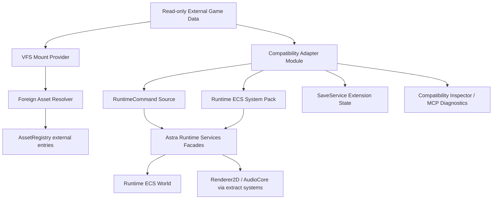

# 外部 VN 引擎兼容与现代化扩展设计

## 1. 目标

Compatibility Layer 用于只读挂载、解析、诊断和现代化外部 VN 引擎项目或老游戏数据。新的兼容策略不定义 `RuntimeBackend`、`RuntimeHost`、`ServicePort` 或替代运行时；兼容能力通过已有机制实现：

- 动态模块与 `ExtensionRegistry`。
- VFS mount provider。
- `foreign-*` AssetId 与 external metadata。
- AssetRegistry、AssetValidator 和 CookProcessor。
- Astra RuntimeCommand 与 Runtime Services facade。
- Runtime ECS 内部 system pack，但不暴露 EnTT。
- VN Property System。
- SaveService extension state。
- Editor Inspector、MCP tools、diagnostics 和 Release Gate。

核心目标：

- 不做 Import，不把外部项目转换为 Astra canonical source。
- 外部游戏数据默认只读挂载。
- 原始资产保留在用户本地原游戏目录中。
- 外部资产通过 `foreign-*` AssetId 和 external metadata 引用。
- 兼容逻辑作为动态模块扩展现有运行时、资产、编辑器和工具链。
- 老游戏现代化通过 UI 覆盖、输入映射、音频总线、本地化覆盖、字体替换、缩放策略、高清化引用和表现规则完成。
- 不直接访问 EnTT、Renderer2D、AudioCore、PlatformSDL3 或 Editor 内部对象。

支持目标：

- Director compatibility module。
- Ren'Py compatibility module。
- KiriKiri compatibility module。
- NScripter compatibility module。
- TyranoScript compatibility module。
- Custom compatibility module。

## 2. 范围与非目标

### 2.1 范围

- 探测外部项目类型。
- 只读挂载外部目录、包或归档格式。
- 解析外部资产引用。
- 建立 external asset registry entries。
- 在运行时读取外部脚本、timeline、score、VM 状态或状态机，并按需生成 RuntimeCommand 或 Runtime Services 扩展事件。
- 通过 Runtime Services facade、RuntimeCommand、系统包和扩展状态参与 Astra 运行时。
- 通过 SaveService extension state 保存兼容模块状态。
- 提供 Compatibility Inspector 供编辑器诊断。
- 支持现代化覆盖配置。

### 2.2 非目标

- 不把 Import Mode 作为设计目标。
- 不默认把外部脚本转换为 `.astra` 或 Story Graph。
- 不默认复制、转换或重打包外部原始资产。
- 不定义替代 Astra Runtime 的运行时后端。
- 不绕过 Runtime Services 直接驱动渲染、音频或存档。
- 不把外部脚本格式作为 Astra 的核心 DSL。
- 不默认解密、破解或绕过受保护商业包。

## 3. 核心结构

```text
CompatibilityCore
├── Extension Points
│   ├── CompatibilityAdapter
│   ├── ForeignProjectProbe
│   ├── ForeignPackageMountProvider
│   ├── ForeignAssetResolver
│   ├── ForeignScriptAdapter
│   ├── RuntimeCommandSource
│   ├── RuntimeEcsSystemPack
│   ├── SaveExtensionStateProvider
│   └── ModernizationOverlayProvider
├── Text Source
│   ├── External Metadata
│   ├── Modernization Config
│   ├── Localization Override
│   └── Diagnostics Snapshot
└── Tools
    ├── Compatibility Inspector
    ├── MCP Tools
    ├── Cook Validators
    └── Release Gate Checks
```

工作流：



## 4. Dynamic Module Integration

兼容模块是普通动态模块，不拥有特殊运行时入口。

```yaml
id: astra.plugin.director_compatibility
display_name: Director Compatibility
version: 0.1.0
astra_api: ">=0.1 <0.2"
modules:
  - id: director_compat.runtime
    type: runtime
    entrypoint: Bin/win64/DirectorCompatibility.dll
    load_phase: asset_registry
    capabilities:
      - compatibility_adapter
      - vfs_mount_provider
      - foreign_asset_resolver
      - runtime_command_source
      - save_extension_state
    permissions:
      filesystem:
        project_read: true
        external_mount_read: true
        project_write: false
      runtime:
        packaged: false
```

规则：

- 模块通过 ExtensionRegistry 注册能力。
- 模块能力必须与 PluginDescriptor capability 和 permission 一致。
- 模块不能替换 Astra runtime loop。
- 模块不能直接持有 Renderer2D、AudioCore、EnTT registry 或 Editor widget。
- 模块需要运行时状态时，必须使用 VN Property System 描述可序列化 state，并通过 SaveService extension slot 保存。

## 5. Runtime Interaction

兼容模块可以用三种现有路径影响运行时：

### 5.1 RuntimeCommand Source

外部脚本、timeline 或 score 适配器在运行时读取外部数据，并生成瞬时 RuntimeCommand。该路径不把外部项目转换为 `.astra`，也不把外部脚本写入 canonical source。

适合：

- 对白推进。
- 背景和立绘切换。
- 音频播放请求。
- 简单选择分支。
- timeline event 转 stage command。

### 5.2 Runtime Services Extension

模块注册服务扩展，参与 Stage、Dialogue、Audio、Input、Save、Localization 等服务的受控扩展点。

适合：

- 输入映射覆盖。
- 字体替换。
- 本地化覆盖。
- 音频总线重映射。
- UI 表现替换。

### 5.3 Runtime ECS System Pack

复杂兼容逻辑可以注册 Runtime ECS system pack，但只能通过公开 system pack API 和 DTO 访问运行时数据，不暴露 EnTT 类型。

适合：

- timeline 推进。
- score clock。
- legacy transition emulation。
- 同步外部 VM 状态与 Astra presentation state。

## 6. Mount-Only Compatibility

```text
用户本地原游戏目录
  -> read-only VFS mount
  -> external asset registry entries
  -> compatibility adapter
  -> RuntimeCommand / Runtime Services extension
  -> Astra Runtime Services
```

规则：

- `compatibility.mount_only: true`。
- `compatibility.allow_asset_copy: false` 为默认值。
- 外部项目缺失时给出明确诊断。
- Cook/package 默认拒绝复制外部原始资产。
- 项目可保存现代化配置、补丁脚本、UI 覆盖、字体替换、本地化覆盖和插件配置。

## 7. 外部资产解析

外部资产统一映射到 `foreign-*` AssetId：

```text
foreign-director:/DATA/CASTS/CHARS.cxt#member=alice_idle
foreign-renpy:/images/alice happy.png
foreign-krkr:/fgimage/alice_happy
foreign-nscripter:/arc/fg/alice.bmp
```

External metadata 只记录引用和语义，不复制二进制：

```yaml
id: foreign-director:/DATA/CASTS/CHARS.cxt#member=alice_idle
type: image
external_source:
  root: compatibility.external_project_root
  package: DATA/CASTS/CHARS.cxt
  member: alice_idle
usage: character_sprite
tags:
  - character
  - alice
modernization_notes: |
  Use Astra dialogue UI and scaling. Do not copy this source asset into cooked output.
cook:
  allow_copy: false
```

解析器职责：

- 路径规范化。
- 编码处理。
- 包内文件定位。
- external asset registry entry 生成。
- 缺失资产诊断。
- 依赖收集。

外部资产不应伪装成 `native:/`。`native:/` 只用于 Astra 原生源资产。

## 8. 现代化覆盖

现代化配置是 Astra 项目的文本源数据，不修改外部原游戏目录。

```yaml
id: modernization.director.sample
target_project: compatibility.project.tsuinosora
ui_overlay:
  dialogue_box: astra.ui.modern_dialogue
  choice_menu: astra.ui.modern_choice
font_replacement:
  default: native:/Fonts/NotoSerifJP
scaling:
  mode: integer_or_fit
audio:
  route_bgm_to_bus: BGM
  route_voice_to_bus: Voice
localization_overlay:
  locale: zh-CN
  source: Content/Localization/tsuinosora.zh-CN.loc.yaml
upscale_refs:
  - source: foreign-director:/DATA/CASTS/CG.cxt#member=opening_cg
    replacement: native:/Modernized/CG/opening_cg_4x
```

覆盖规则：

- 覆盖配置只能引用 Astra 自有资产或外部资产引用。
- 高清化结果若进入项目，必须作为项目自有 `native:/` 资产并带 sidecar、来源和授权说明。
- 外部原资产默认不复制到 cooked output。
- 本地化覆盖、字体替换和 UI 覆盖通过 Runtime Services 扩展实现。

## 9. 存档与状态

兼容模块状态通过 SaveService extension slot 保存：

```yaml
extension_id: astra.plugin.director_compatibility
schema: astra.compat.director.state.v1
state:
  score_frame: 1204
  current_movie: movie.main
  variables:
    flag_intro_seen: true
diagnostics:
  restore_warnings: []
```

原则：

- 状态 schema 由 VN Property System 描述。
- SaveService 负责统一 snapshot，不保存独立替代运行时的私有 blob。
- 插件升级需要迁移策略。
- 无法恢复时应给出明确诊断。

## 10. Compatibility Inspector

编辑器提供 Compatibility Inspector：

- 项目识别结果。
- 启用的 compatibility modules。
- Mount-only 状态。
- 外部项目路径与缺失诊断。
- 包格式与挂载状态。
- external asset registry entries。
- 脚本、timeline、score 或 VM 状态摘要。
- 未支持 API 或行为统计。
- 编码问题。
- SaveService extension state 摘要。
- 现代化覆盖配置。

Inspector 应支持导出诊断报告，便于逐步提高兼容覆盖率。

## 11. MCP 工具边界

MCP 可以调用兼容层工具，但不提供 Import 作为核心能力。

建议工具：

- `compat.probe_project`
- `compat.validate_mount`
- `compat.inspect_assets`
- `compat.inspect_scripts`
- `compat.validate_modernization`
- `compat.generate_diagnostics`

规则：

- MCP 工具不得复制外部原始资产，除非项目显式授权并关闭 mount-only 策略。
- Mutating tools 只能写 Astra 项目的文本配置、覆盖文件、诊断报告或 Operation Log。
- 外部原游戏目录默认只读。

## 12. 测试策略

兼容层测试至少包含：

- Probe Test：识别项目类型。
- Mount Test：只读读取外部目录或包内文件。
- External Asset Resolve Test：解析图片、音频、字体等 external asset refs。
- RuntimeCommand Source Test：同一 fixture 输出稳定 RuntimeCommand log。
- Runtime Services Extension Test：字体、本地化、UI 或音频覆盖可被 Runtime Services 接收。
- Save Extension State Test：保存和恢复兼容模块状态。
- Mount-only Package Test：默认不复制外部原始资产。
- Diagnostics Test：同一 fixture 输出稳定 diagnostics。

每个兼容模块应维护 fixture：

```text
CompatibilityFixtures
├── Director
│   ├── minimal_cast_mount
│   ├── score_dialogue
│   └── image_audio
├── RenPy
│   ├── minimal_dialogue
│   ├── choice_branch
│   └── image_audio
├── KiriKiri
└── NScripter
```

## 13. 分阶段支持建议

第一阶段：

- 定义 CompatibilityAdapter、ForeignProjectProbe、ForeignPackageMountProvider、ForeignAssetResolver。
- 实现项目 probe、只读 mount、external asset registry entries。
- 实现 RuntimeCommand Source 测试夹具。
- 实现 mount-only cook/package 拒绝复制外部资产的 Release Gate。

第二阶段：

- Compatibility Inspector。
- `compat.probe_project`、`compat.validate_mount`、`compat.inspect_assets`。
- Director compatibility mount-only prototype。
- SaveService extension state。

第三阶段：

- Ren'Py、KiriKiri、NScripter 的最小 compatibility module prototype。
- 现代化覆盖：UI、输入、存档、缩放、字体和本地化覆盖。

第四阶段：

- 更复杂 timeline / score / VM 适配。
- 更复杂包格式和编码处理。
- 高级诊断和兼容性测试矩阵。
