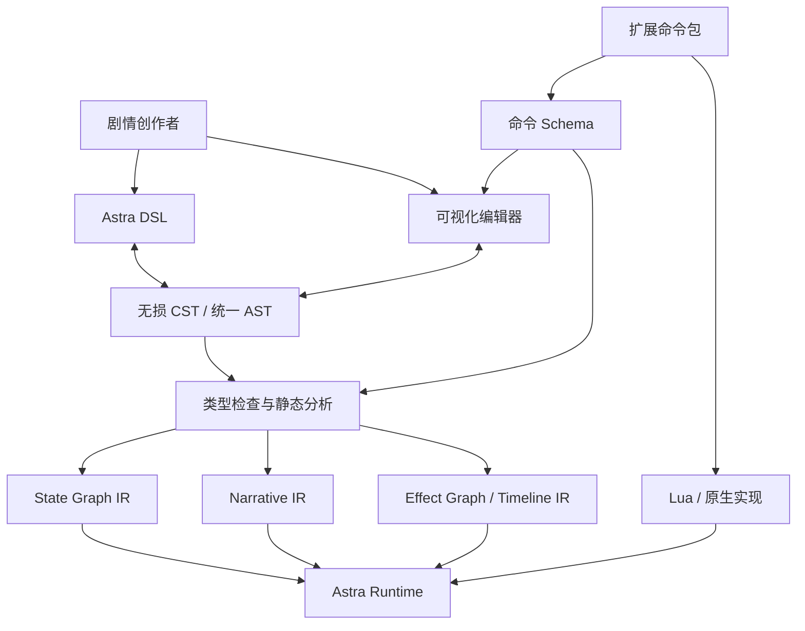

# Astra DSL 设计原则与扩展规范

> 文档状态：设计草案  
> 适用范围：AIVN 剧情 DSL、可视化编辑器、状态机运行时、演出系统、Lua 扩展系统  
> 核心目标：创作者友好、文本与可视化同源、可静态分析、可扩展、可存档、可跳过、可回滚

---

## 目录

1. [设计定位](#1-设计定位)
2. [传统 VN 引擎带来的启示](#2-传统-vn-引擎带来的启示)
3. [总体架构](#3-总体架构)
4. [核心设计原则](#4-核心设计原则)
5. [DSL 基础结构](#5-dsl-基础结构)
6. [状态机与剧情流程](#6-状态机与剧情流程)
7. [舞台状态与演出过程](#7-舞台状态与演出过程)
8. [核心预定义命令与函数](#8-核心预定义命令与函数)
9. [可视化编辑器设计](#9-可视化编辑器设计)
10. [扩展系统设计](#10-扩展系统设计)
11. [Live2D 扩展命令建议](#11-live2d-扩展命令建议)
12. [Emote 扩展命令建议](#12-emote-扩展命令建议)
13. [Lua 扩展 SDK](#13-lua-扩展-sdk)
14. [执行、存档、跳过与回滚语义](#14-执行存档跳过与回滚语义)
15. [AST、IR 与版本迁移](#15-astir-与版本迁移)
16. [稳定 ID 与本地化](#16-稳定-id-与本地化)
17. [项目目录与构建产物](#17-项目目录与构建产物)
18. [完整示例](#18-完整示例)
19. [不可妥协的约束](#19-不可妥协的约束)
20. [验收标准](#20-验收标准)

---

## 1. 设计定位

Astra DSL 是一种：

> **文本优先、可视化同源、状态机驱动、演出时间线化、通过 Lua 实现扩展但不向普通剧情暴露 Lua 的创作者语言。**

系统分为四个层次：

| 层次 | 面向对象 | 主要职责 |
|---|---|---|
| Astra DSL | 编剧、演出、策划 | 对白、分支、场景、舞台、演出与扩展命令调用 |
| 可视化编辑器 | 非程序创作者 | 故事图、场景卡片、舞台预览、时间线、属性面板 |
| Lua 扩展层 | 插件与系统开发者 | 实现专用命令、接入 Live2D、Emote、Spine、小游戏和 UI 系统 |
| 编译与运行时 IR | 引擎内部 | 状态图、叙事程序、效果图、舞台快照、存档与回滚 |

Lua 已经集成在引擎中，但其定位是：

- 扩展实现语言；
- 系统脚本语言；
- 插件适配语言；
- 编辑器与构建工具脚本语言；
- 复杂游戏逻辑实现语言。

Lua **不是**普通剧情创作者必须使用的主脚本语言。

---

## 2. 传统 VN 引擎带来的启示

### 2.1 格式与架构对比

| 引擎 | 剧情脚本特征 | 系统或扩展层 | 优点 | Astra 应避免的问题 |
|---|---|---|---|---|
| KrKr / KAG | 普通文本与 `[tag]`、`@tag` 混写，标签和跳转驱动 | TJS、宏、插件 | 作者脚本简单；剧情与扩展语言分离 | 参数弱类型；大型项目容易退化为标签流和 `goto` 网络 |
| Artemis | Lua 与多种剧情、编译及资源格式共存 | Lua、运行时插件 | Lua 嵌入灵活，适合跨平台与数据驱动 | 纯 Lua 或私有编译格式不利于普通作者和可视化往返 |
| BGI / Ethornell | 剧情 scenario 与内部系统脚本分层 | 独立系统脚本 VM | 系统逻辑与剧情逻辑边界清晰 | 私有 VM 和二进制格式不适合作为开放创作源格式 |
| Ren'Py | Python 风格 DSL，可直接嵌入 Python | Python | 表达力强，生态成熟 | 任意宿主代码会破坏静态分析、确定性和可靠可视化 |
| Tyrano / Naninovel | 文本流中插入命令 | 标签、C# 命令等 | 命令序列直观，较易卡片化 | 全局状态结构和复杂时间关系不是一等语义 |
| Ink / Yarn | 文本、局部分支与自动汇合优先 | 宿主自定义命令 | 编剧阅读负担低，局部分支友好 | 舞台状态与演出时间通常依赖宿主处理 |

### 2.2 Astra 的吸收原则

Astra 应：

1. 借鉴 KAG 的“文本与命令混写”，但使用强类型参数和结构化块。
2. 借鉴 KrKr 的“剧情 DSL + 扩展语言”分层，Lua 对应扩展实现层。
3. 借鉴 BGI 的系统脚本与剧情脚本分离，UI、存档、消息框等由系统层实现。
4. 借鉴 Artemis 的 Lua 可嵌入能力，但不让普通剧情依赖任意 Lua。
5. 借鉴 Ink/Yarn 的局部分支自动汇合，减少标签和无意义图节点。
6. 将状态机、舞台快照、并发效果和时间线提升为一等语义。

---

## 3. 总体架构



核心编译产物分为三类：

1. **State Graph**：章节、路线、场景、事件与跨场景迁移。
2. **Narrative Program**：对白、旁白、局部条件、选择与顺序执行。
3. **Effect Graph**：舞台状态、动画、并行任务、时间线与插件效果。

三者共享稳定节点 ID，并由统一 AST 关联。

---

## 4. 核心设计原则

### 4.1 创作者优先

常见内容必须保持短、直观、接近自然书写：

```aivn
alice[smile]: 早上好。
今天的天气很好。

choice:
  - "回应她" -> reply
  - "保持沉默" -> silence
```

普通创作者不应被迫接触：

- Lua table、回调和协程；
- 组件对象和 SDK 方法名；
- 图层序号和动画对象生命周期；
- 存档序列化细节；
- 状态机内部事件循环；
- `Promise`、future 或线程同步原语。

### 4.2 渐进式复杂度

| 层级 | 面向用户 | 典型能力 |
|---|---|---|
| 基础层 | 编剧 | 对白、旁白、背景、角色、音乐、选择 |
| 演出层 | 演出人员 | 转场、相机、并行、时间线、文本锚点 |
| 流程层 | 高级策划 | 状态、事件、守卫、调用、检查点 |
| 扩展调用层 | 技术创作者 | 调用已注册的专用扩展命令 |
| Lua 实现层 | 程序员 | 实现扩展命令、组件、系统和工具 |

多数剧情文件不应出现 Lua，也不应需要理解扩展内部实现。

### 4.3 文本与可视化同源

- 文本编辑器和可视化编辑器必须操作同一 AST。
- 可视化编辑器不能仅仅“生成一份脚本”。
- 文本脚本也不能是可视化节点导出的不可维护中间结果。
- 注释、空白、源码顺序和未知扩展节点应由无损 CST 保留。

### 4.4 核心语法保持有限

建议核心关键字控制在以下范围：

```text
story data state scene initial
enter exit on
choice when if else
let set inc dec toggle push remove clear
call return emit await
sequence parallel race spawn cancel
timeline stage checkpoint
end
```

其他领域能力优先通过：

- 核心预定义命令；
- 扩展专用命令；
- 声明式演出模板。

### 4.5 强类型而非字符串标签

参数应具有领域类型：

```text
ActorRef
SceneRef
StateRef
EventRef
Asset<Background>
Asset<Voice>
Asset<Motion>
PoseRef
Position
Duration
Ease
Color
Volume
Angle
Percentage
```

因此编辑器可以自动生成资源选择器、枚举、滑块、时间控件和预览按钮。

### 4.6 确定性优先

守卫、状态迁移、存档、回滚和随机行为必须可重放：

- 守卫表达式无副作用；
- 迁移处理期间不允许状态机重入；
- 随机数使用命名随机流；
- 扩展命令声明是否确定；
- 异步任务不能隐式改变流程控制；
- 同一演出通道的并发写入必须可检测。

---

## 5. DSL 基础结构

### 5.1 四种主要语句形式

#### 内容行

```aivn
alice[worried]: 我们迟到了。
narrator: 雨比预想中更大。
```

#### 核心命令

```aivn
show alice pose:worried at:left
play sfx thunder
camera zoom to:1.1 over:500ms
```

#### 结构块

```aivn
parallel:
  move alice to:center over:600ms
  camera pan to:alice over:600ms
```

#### 扩展专用命令

```aivn
@live2d.motion.play actor:alice motion:greet mix:200ms
```

### 5.2 基本语法约定

- 块结构使用缩进。
- 命名参数使用 `name:value`。
- 第一个主要对象可使用位置参数简写。
- 时间值必须带单位，例如 `300ms`、`1.2s`。
- 扩展命令必须使用命名空间。
- 普通 `.aivn` 文件中默认禁止任意 Lua 代码块。
- 场景之间不允许依赖源码顺序隐式落入。

### 5.3 数据声明

```aivn
story main:
  data:
    save trust: int = 0
    save courage: int = 0
    session current_hint: string? = null
    persistent seen_true_end: bool = false
```

建议的数据作用域：

| 作用域 | 生命周期 |
|---|---|
| `local` | 当前块或当前调用 |
| `scene` | 当前场景 |
| `session` | 当前运行会话 |
| `save` | 当前存档 |
| `persistent` | 跨存档持久化 |

---

## 6. 状态机与剧情流程

### 6.1 `state` 与 `scene`

```aivn
state alice_route:
  initial station

  enter:
    play music alice_theme fade:800ms

  exit:
    stop music fade:500ms

  on route.cancel -> common.title

  scene station:
    ...

  scene chase:
    ...
```

语义：

- `state` 表示章节、路线、模式或复合状态。
- `scene` 表示包含顺序叙事程序的叶状态。
- 同一父状态内迁移时，不重复执行父状态的 `enter`。
- 离开整个复合状态时才执行对应 `exit`。

### 6.2 局部分支自动汇合

```aivn
choice:
  - "道歉":
      alice: 至少你愿意承认。
      inc trust

  - "沉默":
      alice: ……算了。

alice: 我们走吧。
```

选项块结束后自然汇合，不要求创建额外标签。

### 6.3 跨场景迁移

```aivn
-> chase
```

`->` 表示真正的状态迁移，运行时应：

1. 执行当前叶状态到公共祖先之间的 `exit`；
2. 执行迁移动作；
3. 执行公共祖先到目标叶状态之间的 `enter`；
4. 完成一个原子状态机步骤后再处理下一个事件。

### 6.4 `call` 与 `->` 的区别

```aivn
call common.name_input
-> next_scene
```

- `call` 保存 continuation，目标 `return` 后回到调用点。
- `->` 是状态迁移，不存在自动返回。
- 不建议提供含义模糊的通用 `goto`。

### 6.5 事件与守卫

```aivn
on timer.expired when can_timeout -> timeout_end
on escape_pressed -> pause_menu
```

建议规则：

- 守卫必须无副作用且不可 yield。
- 优先检查叶状态，再向父状态冒泡。
- 同层多个迁移同时可用时，必须显式优先级或报告歧义。
- 事件进入单一队列，不允许迁移处理中重入状态机。

### 6.6 场景必须明确结束

每个场景必须以以下之一结束：

```aivn
-> next_scene
return
end
await battle.finished
```

缺少终止行为应当是编译错误。

---

## 7. 舞台状态与演出过程

### 7.1 舞台状态

`stage` 描述执行完成后的最终舞台：

```aivn
stage:
  background station_rain
  actor alice pose:worried at:left
  music alice_theme volume:0.8
  camera zoom:1.0
```

舞台状态应可被序列化和重建，包括：

- 当前背景；
- 角色可见性、位置、表情、层级；
- 摄像机最终参数；
- 音乐、环境音和播放位置；
- UI 模式；
- 扩展声明为持久化的组件状态。

### 7.2 演出过程

```aivn
parallel:
  move alice to:center over:700ms ease:in_out
  camera zoom to:1.08 over:700ms ease:out
  play sfx thunder
```

演出过程具有时间、阻塞、并发、取消和跳过语义。

### 7.3 并发结构

```aivn
sequence:
  fade out over:300ms
  background room_night
  fade in over:300ms

parallel:
  move alice to:center over:700ms
  camera pan to:alice over:700ms

race:
  wait 5s
  wait input

spawn rain_loop as:rain_task
cancel rain_task
```

默认规则：

- 普通持续性命令默认阻塞。
- `parallel` 同时启动并等待全部完成。
- `race` 等待第一个完成并取消其余任务。
- `spawn` 明确表示后台任务。
- 不鼓励每条命令自行发明 `wait:false` 等分散语义。

### 7.4 时间线

```aivn
timeline 1200ms:
  at 0ms:
    play sfx thunder

  at 0ms over 900ms:
    flash opacity:0.8 ease:out

  at 150ms over 700ms:
    camera shake strength:0.35

  at 300ms:
    pose alice surprised
```

时间线应直接映射到可视化轨道与关键帧。

### 7.5 对白内演出锚点

```aivn
say alice:
  pose: hesitant
  voice: alice_014
  text: "我以为……{#turn}你不会来。"

  at #turn:
    pose alice surprised
```

锚点使用稳定标识，而不是字符下标，以便翻译人员在译文中调整锚点位置。

---

## 8. 核心预定义命令与函数

标准库应覆盖绝大多数 VN 场景，使普通项目不必为基础功能编写 Lua。

### 8.1 文本与对话

```aivn
alice[smile]: 早上好。
narrator: 天渐渐暗了。
thought alice: 她真的会来吗？
caption "三天后"
clear text
wait input
message style:whisper
text speed:fast
```

展开式对白：

```aivn
say alice:
  pose: worried
  voice: alice_001
  text: "我们迟到了。"
```

### 8.2 背景、角色与舞台

```aivn
background station_rain with crossfade(600ms)

show alice pose:normal at:left with fade(300ms)
hide alice with dissolve(300ms)

pose alice worried
move alice to:center over:600ms
scale alice to:1.1 over:300ms
rotate alice to:5deg over:300ms
opacity alice to:0.5
layer alice above:bob
focus alice
clear stage
```

建议预定义位置：

```text
far_left
left
center
right
far_right
screen(x, y)
anchor(name)
```

### 8.3 摄像机

```aivn
camera cut to:alice
camera pan to:door over:800ms
camera zoom to:1.2 over:500ms
camera shake strength:0.3 duration:400ms
camera follow alice
camera reset over:500ms
```

摄像机应至少划分以下通道：

```text
camera.position
camera.zoom
camera.rotation
camera.shake
```

### 8.4 音频与视频

```aivn
play music alice_theme fade:800ms
stop music fade:500ms
crossfade music to:danger_theme over:1000ms

play ambience rain loop:true
play sfx thunder volume:0.8
play voice alice_001
stop voice

volume music to:0.5 over:300ms
pan sfx to:left
duck music by:0.4 while:voice

play movie opening skip:true
```

建议预定义音频总线：

```text
music
ambience
voice
sfx
ui
```

### 8.5 转场与视觉效果

```aivn
fade out over:500ms
fade in over:500ms
crossfade background to:station_night over:800ms
dissolve alice over:400ms
wipe direction:left over:500ms

flash color:white opacity:0.8
blur stage to:0.6 over:300ms
tint stage color:"#6699cc"
weather rain intensity:0.8
particle petals preset:slow
```

### 8.6 数据与流程

```aivn
if trust >= 3:
  alice: 我相信你。
else:
  alice: 我还不能相信你。

let answer = "truth"
set trust = 3
inc trust
dec courage
toggle has_key
push inventory "ticket"
remove inventory "ticket"
clear temporary_flags

emit quest.completed id:"station"
await battle.finished
checkpoint "before_choice"
end
```

### 8.7 UI 与系统能力

```aivn
ui show phone
ui hide message_window
toast "已获得线索"
input name into:player_name
gallery unlock cg_station
achievement unlock first_meeting
autosave slot:chapter
```

### 8.8 纯表达式函数

建议至少提供：

```text
min(a, b)
max(a, b)
clamp(value, min, max)
abs(value)
round(value)
floor(value)
ceil(value)

len(value)
contains(collection, value)
starts_with(text, prefix)
ends_with(text, suffix)
format(pattern, ...)
coalesce(value, fallback)

seen(line_or_scene)
visited(scene)
completed(state)
has(item)
count(collection)
```

表达式函数必须：

- 无副作用；
- 不可 yield；
- 不直接访问系统时间或非确定随机源；
- 可被编译器和编辑器识别。

### 8.9 可重放随机

```aivn
random choose stream:route_event into:event:
  - 50%: rain
  - 30%: wind
  - 20%: clear
```

随机结果必须进入状态记录，以支持存档与回滚。

---

## 9. 可视化编辑器设计

### 9.1 故事图

只显示：

- `state`；
- `scene`；
- 跨场景 `->`；
- 事件迁移；
- `call`；
- 具有跨场景结果的选择。

普通对白、局部 `if` 和单次演出命令不应成为故事图节点。

### 9.2 场景大纲

以卡片显示：

- 对白；
- 旁白；
- 条件；
- 选择；
- 舞台设置；
- 演出块；
- 调用与迁移；
- 扩展专用命令。

这是普通创作者的主要编辑界面。

### 9.3 舞台预览

支持：

- 拖动角色位置；
- 调整缩放、旋转和层级；
- 选择背景、表情、动作和转场；
- 实时预览音频和角色扩展；
- 将拖动结果写回结构化参数。

例如：

```aivn
show alice at:screen(0.25, 0.82)
```

而不是生成大量底层移动指令。

### 9.4 时间线

默认轨道包括：

- 角色变换轨；
- 摄像机轨；
- 音效轨；
- 音乐轨；
- 视觉效果轨；
- 对白锚点轨；
- 扩展注册的专用轨道。

### 9.5 无损编辑

```text
.aivn 文本
    ↓ 无损解析
CST：注释、空白、源码顺序
    ↓ 语义构建
AST：状态、对白、命令、选择、时间线
    ↓ 类型检查与编译
State Graph + Narrative IR + Effect Graph
```

纯编辑器数据放入旁路文件：

```text
chapter01.aivn
chapter01.aivn.layout
```

`.layout` 不参与运行语义。

---

## 10. 扩展系统设计

### 10.1 扩展是“专用命令包”

扩展不提供任意方法调用入口，而是预先定义一组固定、版本化、强类型的专用命令。

禁止：

```aivn
@plugin.call plugin:"live2d" method:"SetParameter" args:[...]
```

推荐：

```aivn
@live2d.expression.set actor:alice expression:smile blend:200ms
@live2d.motion.play actor:alice motion:greet mix:200ms
@live2d.parameter.tween actor:alice parameter:AngleX to:20 over:400ms
```

普通剧情只调用命令，不直接访问：

- Lua 函数；
- 插件对象；
- C/C++ SDK 方法；
- 反射方法名；
- 任意参数数组。

### 10.2 命名规则

统一采用：

```text
@<扩展 ID>.<对象>.<操作>
```

例如：

```aivn
@live2d.actor.show
@live2d.motion.play
@live2d.expression.set
@live2d.parameter.tween

@emote.actor.show
@emote.pose.set
@emote.motion.play
@emote.variable.tween
```

### 10.3 扩展包必须声明的内容

每个扩展至少声明：

- 扩展唯一 ID；
- 扩展版本；
- 兼容的引擎版本；
- 依赖项；
- 提供的命令列表；
- 每条命令的参数 Schema；
- 执行、存档、跳过和回滚语义；
- 可视化编辑信息；
- Lua 或原生实现入口；
- 版本迁移规则。

示例清单：

```yaml
id: live2d
version: 2.1.0
engine: ">=0.8 <1.0"
commands:
  - actor.bind
  - actor.show
  - actor.hide
  - actor.reset
  - expression.set
  - expression.clear
  - motion.play
  - motion.stop
  - parameter.set
  - parameter.tween
  - look_at.set
  - look_at.clear
  - lipsync.start
  - lipsync.stop
```

### 10.4 命令 Schema

```lua
live2d:command("motion.play", {
  params = {
    actor = aivn.param.actor {
      component = "live2d",
      required = true
    },

    motion = aivn.param.asset {
      kind = "live2d.motion",
      required = true
    },

    loop = aivn.param.boolean {
      default = false
    },

    mix = aivn.param.duration {
      default = "200ms"
    }
  },

  execution = {
    kind = "cue",
    blocking = true,
    deterministic = true,
    skip = "finish",
    save = "snapshot",
    rollback = "snapshot",
    writes = {
      "actor:{actor}.live2d.motion"
    },
    channels = {
      "actor:{actor}.live2d.motion"
    }
  },

  editor = {
    label = "播放 Live2D 动作",
    category = "Live2D/动作",
    icon = "live2d-motion",
    timelineTrack = "Live2D Motion",
    preview = true
  }
}, function(ctx, args)
  local model = ctx:require_component(args.actor, "live2d")
  return model:play_motion {
    motion = args.motion,
    loop = args.loop,
    mix = args.mix
  }
end)
```

编译器只依赖 Schema，不通过分析 Lua 源码猜测命令行为。

### 10.5 扩展命令分类

#### 状态命令

修改可持久化最终状态：

```aivn
@live2d.expression.set actor:alice expression:smile
@emote.pose.set actor:mika pose:worried
```

#### 演出命令

表示具有持续时间的效果：

```aivn
@live2d.parameter.tween actor:alice parameter:AngleX to:20 over:400ms
@emote.variable.tween actor:mika variable:cheek_red to:0.8 over:300ms
```

#### 控制命令

管理扩展对象生命周期：

```aivn
@live2d.actor.bind actor:alice model:alice_main
@live2d.actor.release actor:alice
```

#### 同步命令

连接扩展与引擎系统：

```aivn
@live2d.lipsync.start actor:alice source:current_voice
@live2d.look_at.set actor:alice target:pointer
```

### 10.6 可视化编辑要求

每个扩展命令应至少支持由 Schema 自动生成通用属性面板。

扩展可以额外提供：

- 专用卡片；
- 资源扫描器；
- 动作和表情预览；
- 时间线轨道；
- 自定义曲线或关键帧编辑器；
- 运行时预览适配器。

即使扩展未提供专用 UI，未知参数也不能退化为任意 JSON 输入框。

### 10.7 演出模板与预设

重复命令组合可通过声明式模板复用：

```aivn
cue alice_surprised(actor):
  parallel:
    @live2d.expression.set actor:actor expression:surprised blend:100ms
    @live2d.motion.play actor:actor motion:step_back
    camera shake strength:0.15 duration:250ms
```

调用：

```aivn
perform alice_surprised(alice)
```

扩展也可以提供固定预设命令：

```aivn
@live2d.preset.play actor:alice preset:surprised
```

其中 `preset` 必须是可索引、可验证的声明式资源，而不是任意方法名。

### 10.8 扩展缺失时

编辑器应：

1. 保留原始 AST、命令名和参数；
2. 显示缺失扩展占位卡片；
3. 给出扩展 ID 与版本要求；
4. 禁止该命令预览；
5. 构建时报告明确错误；
6. 不删除未知命令，不将其退化为普通文本。

---

## 11. Live2D 扩展命令建议

### 11.1 模型与显示

```aivn
@live2d.actor.bind actor:alice model:alice_main
@live2d.actor.show actor:alice at:left fade:300ms
@live2d.actor.hide actor:alice fade:300ms
@live2d.actor.release actor:alice
@live2d.actor.reset actor:alice
```

### 11.2 表情

```aivn
@live2d.expression.set actor:alice expression:smile
@live2d.expression.set actor:alice expression:worried blend:200ms
@live2d.expression.clear actor:alice blend:150ms
```

### 11.3 动作

```aivn
@live2d.motion.play actor:alice motion:greet
@live2d.motion.play actor:alice motion:idle_02 loop:true
@live2d.motion.stop actor:alice fade:200ms
@live2d.motion.wait actor:alice
```

持续动作优先使用核心并发结构：

```aivn
spawn:
  @live2d.motion.play actor:alice motion:idle_02 loop:true
```

### 11.4 参数控制

```aivn
@live2d.parameter.set \
  actor:alice \
  parameter:AngleX \
  value:15

@live2d.parameter.tween \
  actor:alice \
  parameter:AngleX \
  to:-20 \
  over:500ms \
  ease:in_out

@live2d.parameter.reset \
  actor:alice \
  parameter:AngleX \
  over:200ms
```

### 11.5 视线与唇形

```aivn
@live2d.look_at.set actor:alice target:pointer
@live2d.look_at.set actor:alice target:bob
@live2d.look_at.clear actor:alice over:200ms

@live2d.lipsync.start actor:alice source:current_voice
@live2d.lipsync.stop actor:alice
```

### 11.6 物理与自动行为

```aivn
@live2d.physics.enable actor:alice
@live2d.physics.disable actor:alice
@live2d.breath.enable actor:alice strength:0.8
@live2d.blink.enable actor:alice interval:3s
```

---

## 12. Emote 扩展命令建议

```aivn
@emote.actor.bind actor:mika character:mika_main
@emote.actor.show actor:mika at:right
@emote.actor.hide actor:mika fade:300ms
@emote.actor.release actor:mika

@emote.pose.set actor:mika pose:smile
@emote.pose.set actor:mika pose:angry blend:200ms

@emote.motion.play actor:mika motion:wave
@emote.motion.stop actor:mika

@emote.variable.set actor:mika variable:cheek_red value:0.8
@emote.variable.tween \
  actor:mika \
  variable:cheek_red \
  to:0.0 \
  over:500ms

@emote.timeline.play actor:mika clip:surprised
@emote.lipsync.enable actor:mika source:current_voice
@emote.lipsync.disable actor:mika
```

Live2D 和 Emote 可以拥有相似概念，但分别提供自己的专用命令，不通过通用 `plugin.call` 或方法反射访问。

---

## 13. Lua 扩展 SDK

Lua SDK 应为扩展开发者提供足够的预定义函数，避免重复实现参数检查、动画任务、通道占用、错误报告和存档策略。

### 13.1 参数定义辅助函数

```lua
aivn.param.actor(...)
aivn.param.asset(...)
aivn.param.duration(...)
aivn.param.number(...)
aivn.param.integer(...)
aivn.param.boolean(...)
aivn.param.string(...)
aivn.param.enum(...)
aivn.param.position(...)
aivn.param.color(...)
aivn.param.angle(...)
aivn.param.percentage(...)
aivn.param.event(...)
```

### 13.2 效果构造函数

```lua
aivn.effect.instant(...)
aivn.effect.task(...)
aivn.effect.tween(...)
aivn.effect.sequence(...)
aivn.effect.parallel(...)
aivn.effect.race(...)
aivn.effect.delay(...)
aivn.effect.repeat_until(...)
```

示例：

```lua
return aivn.effect.tween {
  from = model:get_parameter(args.parameter),
  to = args.to,
  duration = args.over,
  ease = args.ease,

  update = function(value)
    model:set_parameter(args.parameter, value)
  end
}
```

### 13.3 组件与资源访问

```lua
ctx:require_actor(...)
ctx:find_actor(...)
ctx:require_component(...)
ctx:load_asset(...)
ctx:resolve_asset(...)
ctx:current_voice(...)
ctx:current_scene(...)
```

### 13.4 舞台状态与快照

```lua
ctx.stage:get(...)
ctx.stage:set(...)
ctx.stage:remove(...)
ctx.snapshot:capture(...)
ctx.snapshot:restore(...)
ctx.snapshot:register_provider(...)
```

### 13.5 通道与冲突

```lua
ctx.channel:actor(actor, "live2d.motion")
ctx.channel:actor(actor, "live2d.expression")
ctx.channel:actor(actor, "live2d.parameter.AngleX")
ctx.channel:global("weather.rain")
```

### 13.6 事件与任务

```lua
ctx:emit(event, payload)
ctx:wait_event(event)
ctx:cancelled()
ctx:on_cancel(callback)
ctx:checkpoint_allowed()
```

### 13.7 诊断与编辑器元数据

```lua
ctx.diag:error(...)
ctx.diag:warning(...)
ctx.diag:info(...)

aivn.editor.asset_picker(...)
aivn.editor.enum_provider(...)
aivn.editor.preview_provider(...)
aivn.editor.timeline_track(...)
```

### 13.8 Lua 协程限制

Lua 协程可用于命令内部实现，但不应直接作为存档对象。

推荐：

- Lua 构造声明式 `Effect Graph`；
- 运行时保存效果节点进度和舞台状态；
- 存档点只允许出现在可序列化边界；
- 任意 Lua 调用栈、闭包和 C 回调状态不进入普通存档。

---

## 14. 执行、存档、跳过与回滚语义

每条核心命令和扩展命令必须声明以下契约：

| 字段 | 含义 |
|---|---|
| `kind` | 状态命令、瞬时命令、持续效果、控制命令或外部命令 |
| `blocking` | 是否阻塞当前叙事流程 |
| `duration` | 是否具有固定或可计算持续时间 |
| `reads` | 读取的状态路径 |
| `writes` | 修改的状态路径 |
| `channels` | 占用的演出通道 |
| `skip` | 跳过时完成、执行终态、丢弃或禁止 |
| `save` | 快照、可序列化进度、仅检查点或不可保存 |
| `rollback` | 快照恢复、逆操作或禁止 |
| `deterministic` | 是否可确定重放 |
| `preview` | 是否支持编辑器预览 |

### 14.1 跳过语义

建议值：

```text
finish    立即收敛到最终状态
execute   忽略持续时间，但执行副作用
 discard  丢弃纯瞬时效果
forbid    当前阶段禁止跳过
```

例如角色移动在跳过时应直接到达目标位置，而不是停在中间。

### 14.2 存档语义

建议值：

```text
snapshot          通过舞台或组件快照恢复
serializable      可保存效果进度
checkpoint_only   只能在命令前后保存
forbidden         命令执行期间禁止普通存档
```

### 14.3 回滚语义

建议值：

```text
snapshot  恢复执行前快照
inverse   执行注册的逆操作
forbidden 不允许跨越该命令回滚
```

### 14.4 演出通道冲突

以下代码同时写入同一参数：

```aivn
parallel:
  @live2d.parameter.tween actor:alice parameter:AngleX to:20 over:500ms
  @live2d.parameter.tween actor:alice parameter:AngleX to:-20 over:500ms
```

编译器应默认报告冲突，除非作者明确指定覆盖或混合策略。

---

## 15. AST、IR 与版本迁移

### 15.1 扩展命令 AST

```text
ExtensionCommandNode
├─ extensionId: "live2d"
├─ commandId: "motion.play"
├─ schemaVersion: 2
├─ arguments
│  ├─ actor: ActorRef("alice")
│  ├─ motion: AssetRef("greet")
│  └─ mix: Duration(200ms)
├─ stableId: "cmd_7FK2"
└─ sourceRange
```

扩展命令不能只保存为原始字符串。

### 15.2 编译 IR

```text
ExtensionEffectIR
├─ handler: live2d.motion.play@2
├─ serializedArguments
├─ reads
├─ writes
├─ channels
├─ blocking
├─ skipPolicy
├─ savePolicy
├─ rollbackPolicy
└─ deterministic
```

### 15.3 项目依赖声明

```aivn
project:
  extensions:
    live2d: ">=2.1 <3.0"
    emote: ">=1.4 <2.0"
```

### 15.4 命令迁移

```lua
live2d:migrate_command {
  from = {
    command = "motion",
    version = 1
  },

  to = {
    command = "motion.play",
    version = 2
  },

  transform = function(old)
    return {
      actor = old.actor,
      motion = old.name,
      loop = old.loop or false,
      mix = old.fade or "200ms"
    }
  end
}
```

编辑器应能够将旧命令：

```aivn
@live2d.motion actor:alice name:greet fade:200ms
```

迁移为：

```aivn
@live2d.motion.play actor:alice motion:greet mix:200ms
```

---

## 16. 稳定 ID 与本地化

场景、对白、选项和演出节点都需要稳定 ID：

```aivn
scene station:                       #@id scene_7QH2
  alice: 我们迟到了。                #@id line_91KM
```

稳定 ID 用于：

- 翻译文本键；
- 语音关联；
- 存档 continuation；
- 旧版本迁移；
- 自动测试；
- 分支统计；
- 可视化节点关联。

不能使用以下信息作为唯一身份：

- 行号；
- 源文件位置；
- 原文内容；
- 当前可读名称。

编辑器可以默认隐藏 ID，但必须稳定保存。

---

## 17. 项目目录与构建产物

### 17.1 源码目录

```text
project/
├─ story/
│  ├─ common.aivn
│  ├─ alice_route.aivn
│  └─ true_end.aivn
├─ script/
│  ├─ commands/
│  │  ├─ weather.lua
│  │  └─ custom_ui.lua
│  └─ system/
│     ├─ message_window.lua
│     ├─ backlog.lua
│     └─ save_load.lua
├─ extensions/
│  ├─ live2d/
│  └─ emote/
├─ ui/
│  ├─ title_menu.lua
│  └─ config_menu.lua
└─ assets/
   ├─ bg/
   ├─ actor/
   ├─ bgm/
   ├─ sfx/
   ├─ voice/
   └─ video/
```

### 17.2 构建产物

```text
build/
├─ state_graph.ir
├─ narrative.ir
├─ effects.ir
├─ command_manifest.json
├─ text_table.json
└─ source_map.json
```

### 17.3 发布包

```text
game.aivnpkg
├─ bytecode/
├─ lua/
├─ extensions/
├─ assets/
├─ text/
└─ manifest.json
```

源 DSL 是主要创作格式；编译 IR 和打包格式只服务运行时与发布。

---

## 18. 完整示例

```aivn
project:
  extensions:
    live2d: ">=2.1 <3.0"

story prologue:
  data:
    save trust: int = 0
    save courage: int = 0
    persistent seen_station: bool = false

  state alice_route:
    initial station

    enter:
      play music alice_theme fade:800ms

    exit:
      stop music fade:500ms

    on route.cancel -> common.title

    scene station:                         #@id scene_station
      enter:
        stage:
          background station_rain
          camera zoom:1.0

        @live2d.actor.show \
          actor:alice \
          model:alice_main \
          at:left \
          fade:300ms

        @live2d.expression.set \
          actor:alice \
          expression:worried

      set seen_station = true

      narrator: 雨比预想中更大。          #@id line_station_001
      alice: 我们迟到了。                 #@id line_station_002

      parallel:
        camera zoom to:1.08 over:700ms ease:out
        play sfx thunder

        @live2d.motion.play \
          actor:alice \
          motion:look_around \
          mix:150ms

        @live2d.parameter.tween \
          actor:alice \
          parameter:AngleX \
          to:15 \
          over:700ms

      choice "现在怎么办？":              #@id choice_station_001
        - "追上去" when trust >= 2:
            inc courage

            @live2d.expression.set \
              actor:alice \
              expression:determined \
              blend:150ms

            @live2d.motion.play \
              actor:alice \
              motion:start_running

            -> chase

        - "留下来":
            @live2d.expression.set \
              actor:alice \
              expression:sad \
              blend:300ms

            alice: ……好吧。               #@id line_station_003
            -> stay

    scene chase:                           #@id scene_chase
      timeline 900ms:
        at 0ms:
          play ambience heavy_rain

        at 0ms:
          @live2d.motion.play \
            actor:alice \
            motion:run \
            loop:true

        at 0ms over 700ms:
          camera follow alice

        at 200ms over 500ms:
          @live2d.parameter.tween \
            actor:alice \
            parameter:BodyAngleX \
            to:10

      narrator: 她已经冲进雨里。          #@id line_chase_001
      -> next_chapter

    scene stay:                            #@id scene_stay
      narrator: 站台重新安静下来。        #@id line_stay_001
      -> next_chapter
```

---

## 19. 不可妥协的约束

1. 普通 `.aivn` 文件默认禁止任意 Lua。
2. 文本编辑器与可视化编辑器必须操作同一 AST。
3. 核心命令和扩展命令不能把所有参数都视为字符串。
4. 场景之间不能隐式落入下一个场景。
5. 局部分支不应强制生成状态图节点。
6. 舞台最终状态与演出过程必须分离。
7. 扩展只能通过预定义、版本化的专用命令接入。
8. 不提供 `@plugin.call`、反射方法名或任意参数数组。
9. 每个扩展命令必须具有完整 Schema。
10. 每个扩展命令必须声明执行、存档、跳过、回滚和确定性语义。
11. 扩展命令不得直接任意跳转剧情状态；需要改变流程时应发送事件，由状态机处理。
12. Lua 只负责命令实现和系统逻辑，不作为普通剧情入口。
13. Lua 协程栈不能作为普通存档格式。
14. 同一演出通道的并发写入必须可检测。
15. 场景、对白、选项和命令节点必须具有稳定 ID。
16. 未安装扩展时必须保留未知命令 AST，不能静默删除。
17. 扩展升级必须提供版本约束和命令迁移机制。
18. 编辑器至少能够根据 Schema 自动生成扩展命令属性面板。

---

## 20. 验收标准

### 20.1 创作者体验

- 编剧可在不学习 Lua 的情况下完成完整分支剧情。
- 常用对白、角色、背景、音乐、选择和转场均有短语法。
- 局部分支自动汇合，不要求人工创建无意义标签。
- 资源参数可通过选择器完成，不要求记忆文件名。

### 20.2 可视化往返

- 文本修改后，故事图、场景卡片和时间线可无损刷新。
- 可视化操作只修改对应 AST 节点，不重写整个文件。
- 注释、稳定 ID 和未知扩展命令能够保留。

### 20.3 扩展接入

- 新扩展可通过“命令包 + Schema + Lua/原生实现”接入。
- 编译器无需理解扩展内部源码即可检查参数类型。
- 编辑器可依据 Schema 自动生成卡片和属性面板。
- 扩展可注册资源选择器、预览器和时间线轨道。

### 20.4 运行时可靠性

- 所有持续性命令有明确阻塞和取消语义。
- 跳过演出后舞台能够收敛到正确最终状态。
- 存档加载可通过舞台快照和可序列化 IR 恢复。
- 回滚不会依赖不可序列化 Lua 调用栈。
- 并发通道冲突可在编译期或运行时明确报告。

### 20.5 工程可维护性

- 核心 DSL 关键字数量受控。
- 扩展命令具备命名空间、版本和迁移规则。
- 编译产物包含 Source Map，错误可定位回源码和可视化节点。
- 稳定 ID 支持本地化、语音绑定、旧存档迁移和自动测试。

---

## 结论

Astra DSL 的最终方向可以概括为：

> **以创作者友好的文本 DSL 表达剧情，以状态机管理跨场景流程，以舞台快照和效果图管理演出，以统一 AST 支撑文本与可视化双向编辑；扩展则通过一组预定义、强类型、版本化的专用命令接入，并由 Lua 或原生模块实现。**

这种结构同时保留了传统 VN 标签脚本的易用性、Lua 扩展的灵活性、现代可视化工具的生产效率，以及状态机在确定性、存档、回滚和复杂流程管理方面的优势。


