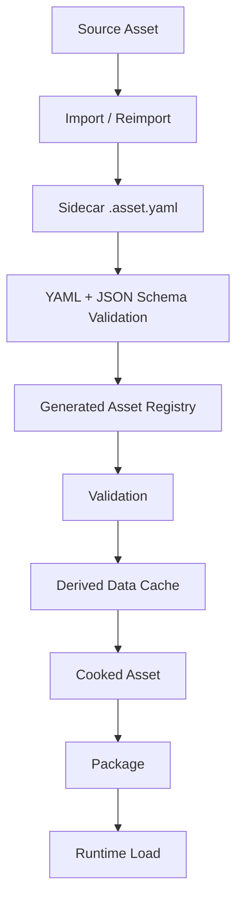

# Editor 与构建流水线设计

## 1. Editor 目标

AstraEditor 提供 UE 风格但面向视觉小说简化的工作流。它的目标不是成为通用游戏编辑器，而是让 VN 创作者高效完成项目管理、剧情编辑、场景预览、AI 审查、资源管理、构建发布。

核心能力：

- 项目创建和配置。
- 资产导入、标注、预览。
- 脚本和剧情图编辑。
- 场景预览和 Play In Editor。
- AI Agent Workbench。
- Review Queue 和 Diff/Patch Viewer。
- 本地化、QA、构建和打包。

## 2. Editor 模块

```text
AstraEditor
├── Project Browser
├── Content Browser
├── Asset Detail Panel
├── Scene Editor
├── Story Graph Editor
├── Script Editor
├── Character Editor
├── Lore Editor
├── Prompt / Agent Editor
├── Agent Workbench
├── Review Queue
├── Diff/Patch Viewer
├── Compatibility Inspector
├── Play In Editor
├── Build Settings
└── Output Log
```

模块原则：

- Editor 只能依赖 Runtime，Runtime 不能反向依赖 Editor。
- 编辑器资产操作必须通过 AssetTools 和 AssetRegistry。
- AI 相关 UI 只能通过 Boundary Manager 和 Review Queue 修改项目。
- PIE 通过 Runtime Services 运行，不走独立预览逻辑。
- Editor MCP trusted session 可以通过 Editor MCP Host 直接写入项目文本源文件，但必须记录 Operation Log。
- Editor 扩展通过动态模块和 ExtensionRegistry 注册面板、菜单、属性详情页、预览器和验证器。

## 3. 项目目录设计

```text
Projects/MyVisualNovel
├── MyVisualNovel.vnproj.yaml
├── CMakeLists.txt
├── Config
│   ├── DefaultGame.yaml
│   ├── DefaultEditor.yaml
│   ├── DefaultAI.yaml
│   ├── DefaultInput.yaml
│   └── DefaultPackaging.yaml
├── Source
│   ├── MyVisualNovelRuntime
│   └── MyVisualNovelEditor
├── Content
│   ├── Characters
│   │   ├── alice.character.yaml
│   │   ├── alice_normal.png
│   │   └── alice_normal.png.asset.yaml
│   ├── Backgrounds
│   ├── Audio
│   ├── Voice
│   ├── UI
│   ├── Scripts
│   ├── StoryGraphs
│   ├── Agents
│   ├── Prompts
│   ├── Lore
│   ├── Localization
│   └── Tests
├── Schemas
│   ├── asset.schema.json
│   ├── plugin.schema.json
│   ├── character.schema.json
│   ├── lore.schema.json
│   ├── story.schema.json
│   ├── localization.schema.json
│   └── review.schema.json
├── Plugins
│   └── ExamplePlugin
│       └── ExamplePlugin.plugin.yaml
└── Saved
    ├── Autosaves
    ├── Cooked
    ├── Logs
    ├── DerivedDataCache
    └── Agent
        ├── Suggestions
        ├── ReviewQueue
        └── Audit
            ├── Generation
            └── Operations
```

目录语义：

- `Config`：项目配置，进入版本控制。
- `Source`：项目扩展代码，可选。
- `Content`：可编辑源资产，进入版本控制。文本源数据使用 YAML，脚本使用 `.astra` 文本 DSL，二进制资源使用 `.asset.yaml` sidecar。
- `Schemas`：JSON Schema，用于校验 YAML 源数据。
- `Plugins`：项目级插件。
- `Saved`：本地生成内容，默认不进入版本控制，除非明确需要。
- `Saved/Agent`：Agent 建议、审核队列和审计数据。`Audit/Generation` 记录生成来源，`Audit/Operations` 记录 MCP tool side effect；是否入库由项目策略决定。

## 4. 资产生命周期



资产状态：

- Source：原始文件，如 PNG、PSD、WAV、OGG、VN DSL。
- Sidecar：二进制资源的同名 `.asset.yaml`，是资产语义元数据的 canonical source。
- Registry：由 sidecar 扫描生成的索引，不作为主要人工或 AI 编辑源。
- Derived Data：可重建的中间产物，如纹理压缩、字体图集、音频转码。
- Cooked：发布包使用的运行时格式。
- Packaged：最终 PAK、ZIP 或平台包。

## 5. AssetRegistry

AssetRegistry 应支持：

- 按 AssetId 查询。
- 按类型查询。
- 按标签查询。
- 按依赖查询。
- 按来源查询。
- 检测缺失依赖。
- 检测循环依赖。
- 生成 cook 依赖清单。

AssetRegistry 由 `.asset.yaml` sidecar 生成。建议编辑器侧使用可持久化索引，运行时侧使用 cook 后的紧凑 registry。

生成前必须检查：

- YAML 语法。
- JSON Schema。
- 缺失 sidecar。
- 重复 AssetId。
- 缺失 source file。
- 依赖无法解析。
- AI-editable 字段和 read-only 字段边界。

## 6. Play In Editor

PIE 支持：

- 从开头运行。
- 从当前 Scene 运行。
- 从当前 Story Node 运行。
- 注入变量运行。
- 模拟玩家选择。
- 模拟 Agent 输出。
- 查看 Runtime Command Log。

运行模式：

- Play In Editor。
- Standalone Game。
- Headless Simulation。
- Packaged Preview。

PIE 不应复制一套特殊运行逻辑，而应通过 Runtime Services 启动同一 Runtime。差异只在输入来源、调试覆盖层和资产加载路径。

## 7. Build / Cook / Package

构建流程：

```text
Edit Source Assets
  -> Validate
  -> Cook
  -> Build
  -> Package
  -> Release
```

Cook 阶段负责：

- YAML 源数据校验。
- 脚本编译。
- 剧情图验证。
- sidecar 扫描。
- AssetRegistry 生成。
- 资产格式转换。
- 纹理压缩。
- 音频转码。
- 字体图集生成。
- 本地化表生成。
- AI 内容审计。
- 兼容层资源缓存。
- 依赖收集。
- PAK 打包。

## 8. 发布模式

```text
Deterministic Build
- 只包含已审核固定内容。
- 不包含运行时 LLM。
- 适合商业发布。

Hybrid Build
- 固定主线 + 动态闲聊。
- 包含 Runtime MCP Host、Runtime Generation 和 runtime-safe Provider。

Experimental Build
- 允许更高 AI 自由度。
- 适合测试或研究。
```

默认发布模式应是 Deterministic Build。

## 9. Release Gate

发布前必须通过以下检查：

- 所有 YAML 源文件可解析并符合 JSON Schema。
- 所有脚本可编译。
- Story Graph 无死分支或未连接入口，除非明确标记为草稿。
- 资产 sidecar 完整。
- 资产依赖完整。
- AssetRegistry 与 sidecar 同步。
- 本地化 key 完整。
- 文本框无已知溢出，或溢出已被接受。
- 未审核 AI 内容数量为 0，除非构建模式允许。
- Runtime MCP / Generation 策略与发布模式一致。
- PluginDescriptor、动态模块 ABI、依赖闭包、权限声明和 packaged runtime eligibility 有效。
- Mount-only compatibility 项目没有复制或打包外部原始资产。
- external asset root、package 或 member 引用可解析。
- 存档版本号和迁移策略有效。
- 目标平台资源格式可加载。

AI Release Gate 示例：

```json
{
  "allow_unreviewed_ai_content": false,
  "allow_runtime_ai": false,
  "require_ai_audit_report": true,
  "block_on_missing_provenance": true
}
```

## 10. 工具程序

```text
Programs
├── AstraEditor
├── AstraGame
├── AstraAssetCooker
├── AstraBuildTool
├── AstraPackageTool
├── AstraProjectGenerator
└── AstraHeadlessTest
```

### 10.1 AstraAssetCooker

职责：

- 扫描 `.asset.yaml` sidecar。
- 校验 YAML 和 JSON Schema。
- 生成 AssetRegistry。
- 计算依赖。
- 生成 Derived Data。
- 输出 Cooked Content。
- 生成运行时 registry。

### 10.2 AstraBuildTool

职责：

- 读取项目构建配置。
- 调用 CMake 或平台工具链。
- 管理构建缓存。
- 组织目标平台输出。

### 10.3 AstraPackageTool

职责：

- 打包 Cooked Content。
- 生成 patch 包。
- 生成发布 manifest。
- 生成 AI 审计报告。

### 10.4 AstraHeadlessTest

职责：

- 自动运行剧情路径。
- 执行分支覆盖测试。
- 检测脚本错误。
- 模拟输入。
- 输出 Runtime Command Log。

## 11. 本地化流程

建议本地化文本通过稳定 key 管理：

```yaml
locale: zh-CN
entries:
  - key: chapter_01.alice.line_0120
    speaker: character.alice
    text: |
      你来了。
```

本地化检查：

- 缺失翻译。
- 术语不一致。
- 角色口吻偏移。
- UI 文本溢出。
- 富文本标签不匹配。

## 12. 测试策略

最低测试层级：

- Unit Test：Core、VFS、AssetId、DSL Parser、RuntimeCommand、Astra Runtime session lifecycle。
- Integration Test：Runtime Services、Save/Load、Cooked Asset Load。
- Headless VN Test：自动跑剧情路径和选择。
- Editor Smoke Test：项目加载、资产导入、PIE 启动。
- Compatibility Test：外部项目 probe、RuntimeCommand log、只读挂载、资产解析、mount-only policy。
- AI Policy Test：Boundary Manager、Review Queue、Release Gate。
- Text Source Test：YAML parse、JSON Schema、sidecar、重复 ID、依赖解析。
- MCP Tool Test：Editor trusted direct write、Runtime capability boundary、Operation Log / Generation Audit、路径边界、secret redaction。
- Module Test：descriptor schema、动态加载、依赖顺序、权限诊断、packaged runtime 模块过滤。

测试数据应包含：

- 最小 Astra VN Demo。
- 多语言文本样例。
- 缺失资产样例。
- 复杂分支样例。
- 外部引擎兼容样例。
